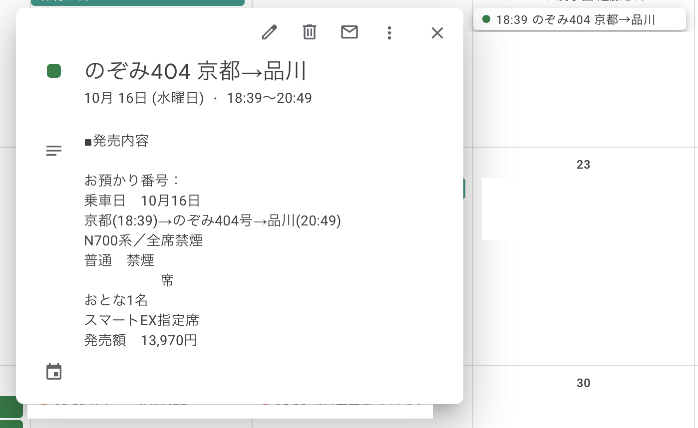

この記事は [CAMPHOR- Advent Calendar 2019](https://advent.camph.net/) 13 日目の記事です．

こんにちは、どら([@d0ra1998](https://twitter.com/d0ra1998))です。  
京都に住んでいるはずですが、気づいたら 12 月は東京と 3 往復するそうです。師走ですね（適当

さて、突然ですが、皆さんは受信トレイに届くメールに全て目を通せていますか？

今月の電気代やクレカの請求額、新幹線乗車券の購入、はたまた観に行く映画のチケット……

いっぱいありますね。今日はそのような機械送信されるメールを少しでも有効活用する方法を紹介したいと思います。

## この記事で紹介するもの

さて、先ほど様々な種類のメールを挙げましたが、今回取り上げるのは

- 新幹線乗車券(スマート EX)の購入メール
- 映画のチケット購入メール

の 2 つです。

どちらも日時を確実に把握する必要があり、以前は手作業でメールから情報を転記してカレンダーに登録していましたが、今回はこれを自動化してみます。うまくいくと、こんな感じで登録されます。



## 実装の流れ

主なプログラムの流れとしては下のような感じです。今回は、メールもカレンダーも Google アカウントを使用するので、Google Apps Script (GAS)で書いていきます。

1. 前回の定期実行後に届いた該当メールを Gmail から取得
1. メッセージ内容をよしなにパース
1. Google カレンダーに予定として登録

## メールをパースしてみる

メールの本文を取得できたとして、その内容を解釈する部分を取り上げていきたいと思います。まずは、**新幹線乗車券(スマート EX)の購入メール**でやってみましょう。

スマート EX から届くメールの原文と、そこから取り出したい情報を考えるとこんな感じになります。



これをいい感じに正規表現に落とし込みます。パターン自体が複数行となるように作成してもいいのですが、テスター等でチェックしづらいので 1 行で作成しています。

```javascript
/■発売内容[\r\n]+お預かり番号：.+[\r\n]+乗車日　([0-9]+)月([0-9]+)日[\r\n]+(.+)\(([0-9]+:[0-9]+)\)→(.+)号→(.+)\(([0-9]+:[0-9]+)\)[\s\S]+（ご案内）/m;
```

これはパターンにマッチするかを[テスター](https://regex101.com/)でチェックしたところ。大丈夫そうです。



## 完成したプログラム

以上をもとに全て実装したプログラムがこちらになります(3 分クッキング)

<script src="https://gist.github.com/dora1998/5a626f20797bd305fd93c76faab9da1b.js"></script>

あとは、これを GAS で定期実行してあげれば OK です。なお、Gmail の API には[回数制限](https://developers.google.com/apps-script/guides/services/quotas)があります。サンプルでは 5 分毎に実行する想定で記述しており、2 万回の利用枠のうち、5 件 × 288 回 = 1,440 回を消費することになります。

制限について詳しくは下の記事に譲りますが、他にスクリプトを動かしている場合など、適宜間隔は調整してください。

[Google Apps Script における Gmail の読み出し件数の制限とその対処法](https://tonari-it.com/gas-gmail-search-limit/)

## 映画館のチケットも登録してみる

筆者がよく行く MOVIX 京都の映画チケットについても、同様にメールからの自動登録を行ってみました。  
カレンダーには以下のような感じで登録されます。


<details>
<summary>
実装コード
</summary>
<script src="https://gist.github.com/dora1998/ba99368e26a7d236f9b87b5fb34a6c66.js"></script>
</details>

## まとめ

GAS を使うと、Gmail と Google カレンダーとの連携が簡単にとることができました。皆さんもぜひ自分にとって頻度の高かったり、重要だったりする予定の自動登録に挑戦してみてくださいね。

書き終わってから気づいたのですが、2016 年の本アドベントカレンダーでほぼ似たテーマの記事があって驚きました。

[GAS で DMM 英会話の予約メールから自動的にカレンダーに登録 | shotarok&#39;s Tech Blog](http://blog.shotarok.com/post/2016-12-09-auto_creation_of_eikaiwa_events/)

明日の CAMPHOR- Advent Calendar の担当は、[satomi](https://note.mu/___msato)さんです。
