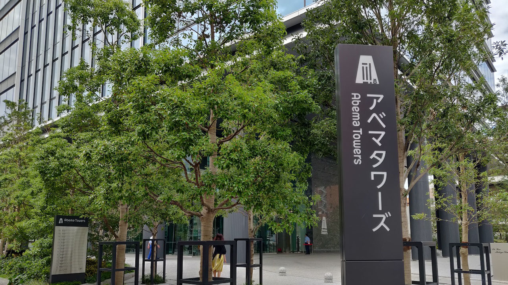
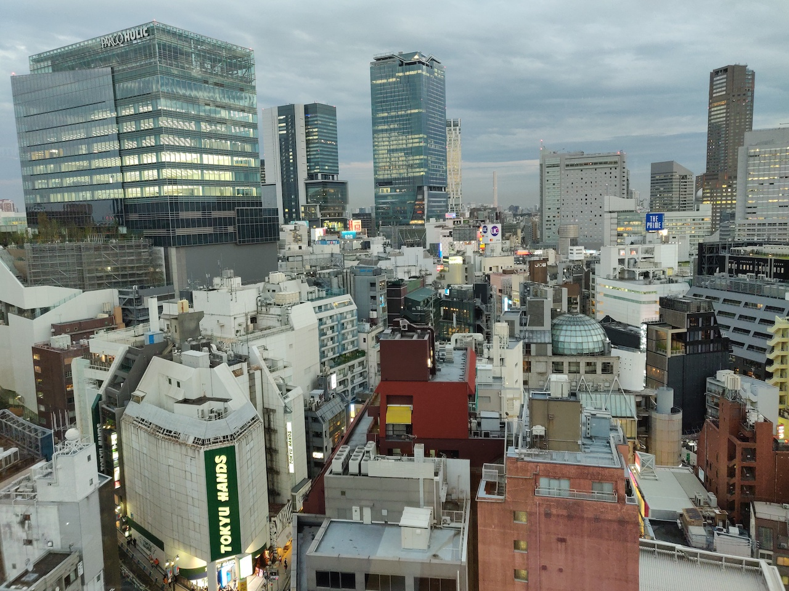
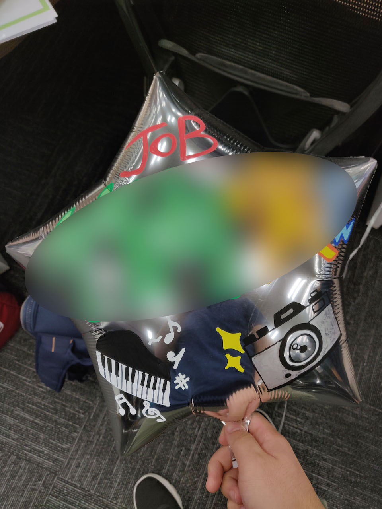
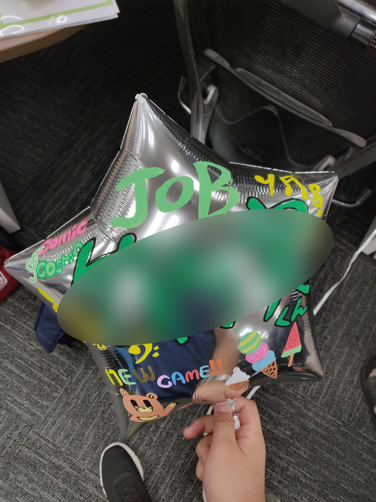
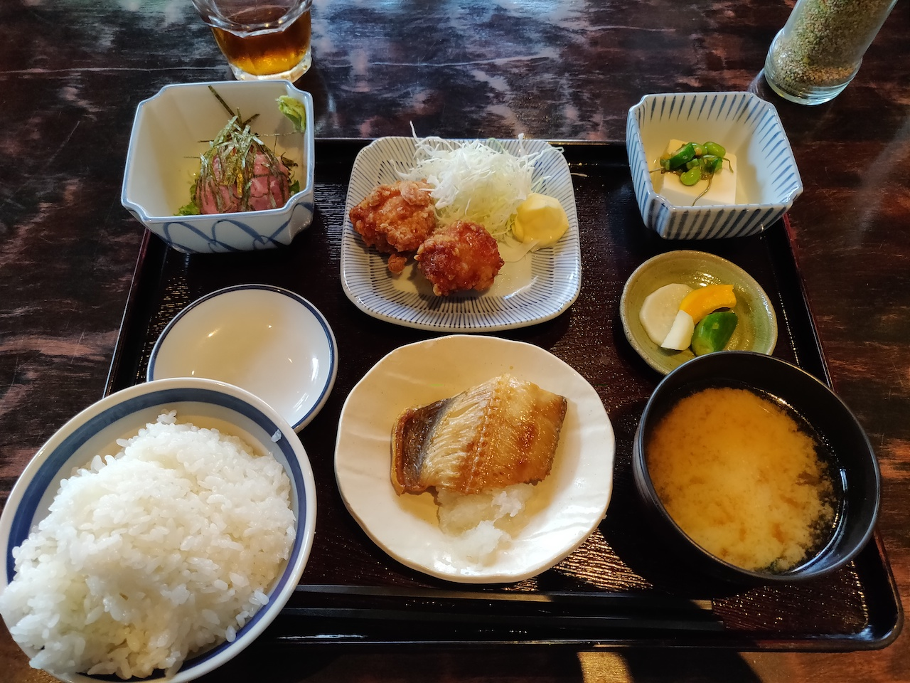
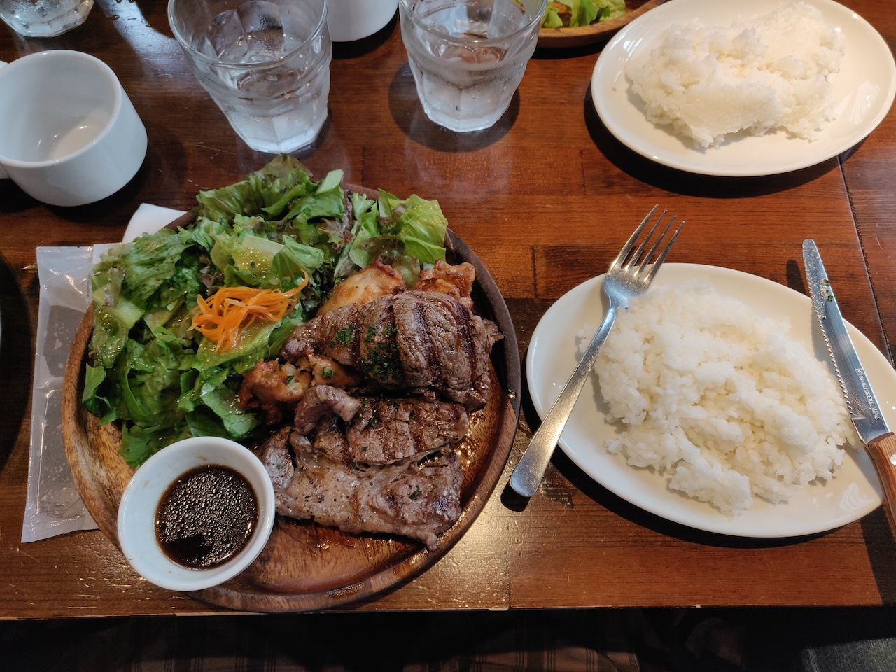
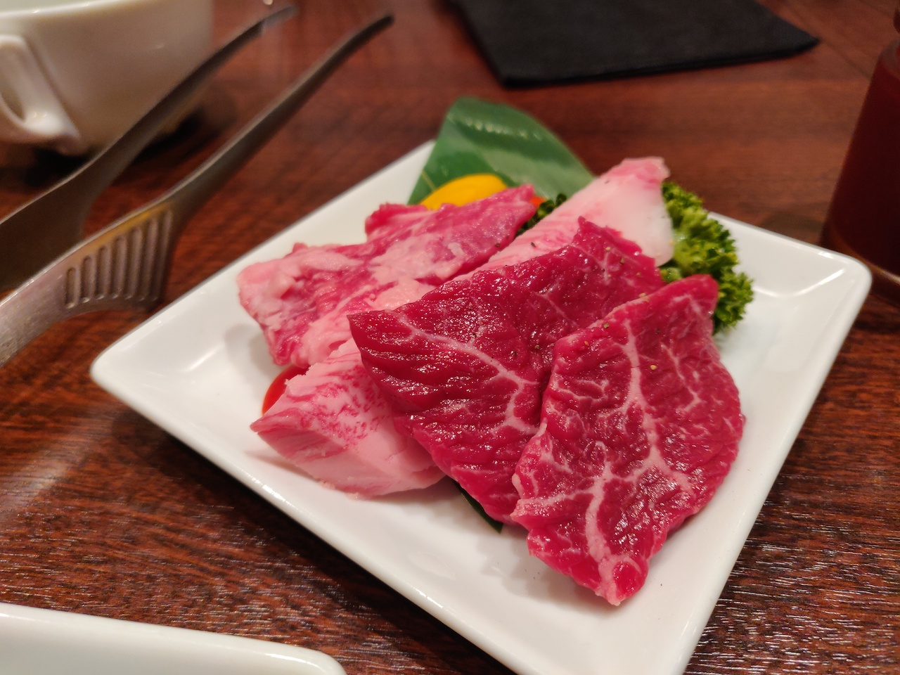

10 月になりましたが、京都は 30℃ 超えで溶けそうです。どら([@d0ra1998](https://twitter.com/d0ra1998/))です。

さて、タイトルの通り、ほぼ 9 月いっぱいの間、CyberAgent の就業型インターン「CA Tech JOB」に参加してきました！  
僕が配属されたのは AbemaTV の Web チームで、どんなことをしたかや働いての感想などを書いていきたいと思います。

## 参加するまでの経緯・流れ

3 月に同じく CyberAgent 主催の「Web Frontend Challenge」に参加したのが、CA との初の接点でした。  
こちらについては、詳しくは下の記事を読んでもらえればと思います。

この時の繋がりがきっかけで、就業型インターンも参加してみない？とお話をいただき、もともと興味があったので是非！と選考を受けたという流れです。

### どうして AbemaTV？

AbemaTV は、インターネットテレビ局を謳い、一般の地上波放送と同じように常時 20 チャンネル以上で番組を放送している動画サービスです。  
特に最近だと、会見のノーカット放送やアニメの一挙放送などで知っている・使っている人も多いのではないかと思います。

僕は、この夏のインターンで主に以下のようなことがしたいと考えており、ちょうど AbemaTV が当てはまったという次第です。

- ユーザーとして自分が使っている（使いたい）サービスの開発
- 現在できるスキル＋ α が身につきそうな環境
- 大規模なコードの開発に加わる経験

また、先ほど挙げた「Web Frontend Challenge」の際のメンターさんが AbemaTV で働いていたのも大きなきっかけです。  
今回のインターンでもトレーナーとしてお世話になることが決まり、安心してインターンに臨めたというのはとても大きかったです。

## 何をやったのか

### [1-2 週目] Sketch のデザイン追従

環境構築を終えた後は、CSS をいじるのが結構好きという希望を伝えたら、まずは現在の実装と Sketch との差分をなくす作業をやろうということになりました。  
作業としては細かいものが多かったものの、チーム内での

- 共通 UI コンポーネントの使い方
- 現在進行中のリファクタリング
- PR やコミットの書き方、粒度

などを学ぶことができました。

AbemaTV は約 3 年半が経つ大きなプロダクトなので、リファクタリングも漸進的に進められています。見た目上大きな変更はない場合でも、実はそれなりにリファクタリングしているということもよくありました。

### [2-3 週目] 新規施策の実装

当初トレーナーの方がやる予定だった施策の 1 つを、しばらく手がつけられなさそうということで丸っと振ってもらいました。

詳しくはリリース前で言えないのですが、主にモバイル向けページへの新規実装を行なっていました。
出現・消滅条件などが割と複雑だったので、RxJS の恩恵を感じることができました。大きな成果を出せてとても達成感があり、嬉しかったのを覚えています。

（もうすぐリリースなので、内容はおいおい追記します）

### [3 週目-] リファクタリングやバグ修正

前述の施策が思ったよりも早く終わってしまったので、最後の 1 週間はインターン生向けタスクとしてまとめてある中から、面白そうな issue を拾っては取り組んでいました。

#### 関数の置き換えと TS 化

deprecated になった社内の関数について、まだ使っていた部分を修正した上で削除し、ついでに残ったメソッドの TypeScript 化を行いました。

AbemaTV は Vanilla JS や FlowType がメインだった過去があり、まだ一部 TypeScript ではない部分が残っているという感じでした。
TypeScript による型付けは、最近好きな作業の一つなので楽しかったです。

#### 謎の表示エラー修正

特定の条件でページが正しく描画されず、ローディングが無限に表示されるという割とヤバめなバグがあったのですが、コードを辿り直すことができました。

Blame などで該当するファイルのコミット履歴をたどっていったのですが、途中ファイル構成の変更などもあり、地味ながらも大変な作業でした。ちなみに、チームの皆さんはこういう作業を**「考古学」**と呼んでいて面白かったです(笑)

## 学んだこと

### RxJS は面白い

AbemaTV Web のストアは、React とよく一緒に使われる Redux などではなく、RxJS を活用した独自実装の Flux ストアで構成されていました。
Swift や Kotlin などではよく聞く Rx ライブラリですが、僕自身は Android アプリで遥か昔に触ったぐらいでした。

最初の 1 週間ぐらいは、主な概念や使い方の勉強をしていました。勉強にあたり、特に Angular の RxJS の説明が綺麗に日本語化もされており、わかりやすかったです。

[Angular - RxJS ライブラリ](https://angular.jp/guide/rx-library#rxjs-%E3%83%A9%E3%82%A4%E3%83%96%E3%83%A9%E3%83%AA)

基礎を理解した後は、こちらのサイトを見つつ、適切な Operator を探したりして実装しました。

[Learn RxJS](https://www.learnrxjs.io/)

最初こそ苦戦したものの、慣れてしまえば非同期通信やイベントの発火などのデータストリームに対して、複雑な処理も綺麗に書けるので、後半は結構楽しむことができました。

RxJS については、チーム内で共有されていた練習問題集が、先日の技術書典 7 で頒布された「AbemaTV Tech Book」にあるので、気になる方は是非ご覧ください。

### 適切なコミットは後の自分を救う

今までのインターンでは、コミットのメッセージや粒度にそこまで大きく気を遣うことはありませんでした。しかし、はじめの方に指摘を受けて、せっかくなのでいい機会と思い、毎回 rebase も駆使しつつ丁寧なコミット履歴を心がけていました。

最初は「後から見て綺麗だしね」ぐらいにしか思ってなかったんですが、2 回ほどマージ後に変更を取り消す機会があり()、該当コミットを revert するだけでほぼ済んだので、**自分のためにも綺麗なコミットツリーは大切**だなと思いました。

### QA があることの安心感

AbemaTV Web では、随時リリースするという感じではなく、2 週間くらいのサイクルで**「実装 →（コードフリーズ）→ QA → リリース」**という流れで開発が進められていました。

どうしてもフロントエンド開発は機械的なテストだけでカバーできない部分も多いですが、QA チームの方々が丁寧に検証してくださることで安心して開発ができました。  
特にブラウザや端末固有の不具合なども、発生条件や再現方法などをきちっとまとめて報告してくださり、スムーズに修正作業も行うことができました。

## 職場環境とか

### 優秀な人と働くということ

Web チームには僕を除いて 11 人のメンバーがいらっしゃいましたが、各々がいろんな方向にスキルレベルが高い方ばかりでとても刺激になりました。

Web ブラウザ周りは特に日進月歩の世界ですが、新しい情報へのアンテナ感度の高さも節々で感じました。また、**仕入れた情報に対して、「これは自分たちのプロダクトにどう影響するか？」という視点を持って、すぐ行動できる姿勢**は自分にも取り入れていきたいと思いました。

### 10:30 は（自分には）ちょうどいい

CA 全体では 10〜19 時が定時となっているのですが、AbemaTV は 10:30~19:30 が定時となっていました。

まぁ後述の通り、出勤は秒なのですが、**朝が大変苦手**な僕としては 10 時半ぐらいにちょうど脳が起きてくるので良いなぁと思いました。日によっては、 9:30-18:30 勤務をする人もいたので、そこらへんを柔軟にできるのも良さそうでした。

~~インターンを通して、9 時出社の会社とか絶対無理だと思ったり~~

ただ、朝遅い分、午後の時間が長く間延びした感じになります。そのため、夕方はよくカフェやローソンのある 11F に行って、コーヒーを飲んだり景色を眺めたり仮眠したりしてリフレッシュしました。

### 通勤時間が短いのは最高

期間中は、京都から来ていたので会社のシェアハウスに滞在していました。立地はとてもよく、勤務地の **Abema Towers まで徒歩 5 分未満、渋谷駅まで 15 分弱**といった素晴らしい場所にあります。

9 月末でなくなってしまうので、これからインターンへ行く人の参考にはならないですが、中の様子は同じ期間にインターンをしていた[クボ太郎](https://twitter.com/kubo_programmer)くんがツイートしていたので、引用させてもらいます。



## 1 ヶ月のインターンを終えて

1 ヶ月という期間は自分の中で過去最長だったこともあり、インターン前は漠然とした不安に襲われがちでした。しかし、始まってみれば、そんな不安を吹き飛ばすような、あっという間の 1 ヶ月間でした。  
1 ヶ月もいると別れ際は卒業のような気持ちになりましたが、チームの皆さんに温かく送り出していただき、幸福感いっぱいでインターンを終えることができました。

このインターンを通して、サービス開発を行うエンジニアとして一回り、ふた回り成長できたのではないかと思っています。
これからも歩みを止めることなく、さらなる高みを目指したいと思います！

## おまけ

### 風船がすごい

インターンや内定者バイトの席上には、名前が書かれた風船が浮かんでいてフロアでわかりやすいようになっています。

これ、実は事前に送った自己紹介内の趣味欄を参考にイラストを描いているらしく、素直に趣味を書いたら、なんともオタクな風船が出来上がっていました(笑)  
デレステのつい直近までやっていた comic cosmic とかも描いてあり、クオリティがめちゃくちゃ高くておったまげました。

### ランチが最高だった

Welcome ランチやチームランチ、シャッフルランチといろんな方とのランチを設定していただき、インターンが終わるまで自分で昼飯を調達することは一度もありませんでした。

もちろん美味しいランチを奢っていただいたのも有難いですし、興味があった事業のエンジニアの方や他のインターン生とたくさん話す良い機会でもありました。

## 終業後の生活

終業後も即戻れて渋谷をぶらぶらできるので、駅反対側のタイトーステーションにオンゲキをしに行ったり、友達と飲んだり、ヴァイオレット・エヴァーガーデン 外伝を観に行ったりと、有意義な夜が過ごせました。





定時前後を有効活用するために、やっぱり職場近くに住むのは良さそうです。CA で言う 2 駅ルールのようなものがある会社も多いので、就職したら活用したいと思いました。
