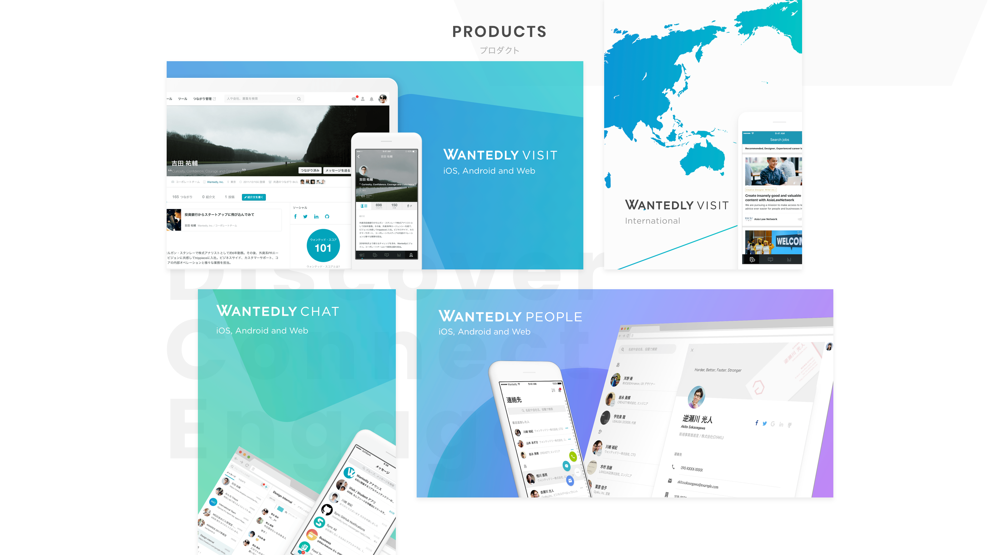
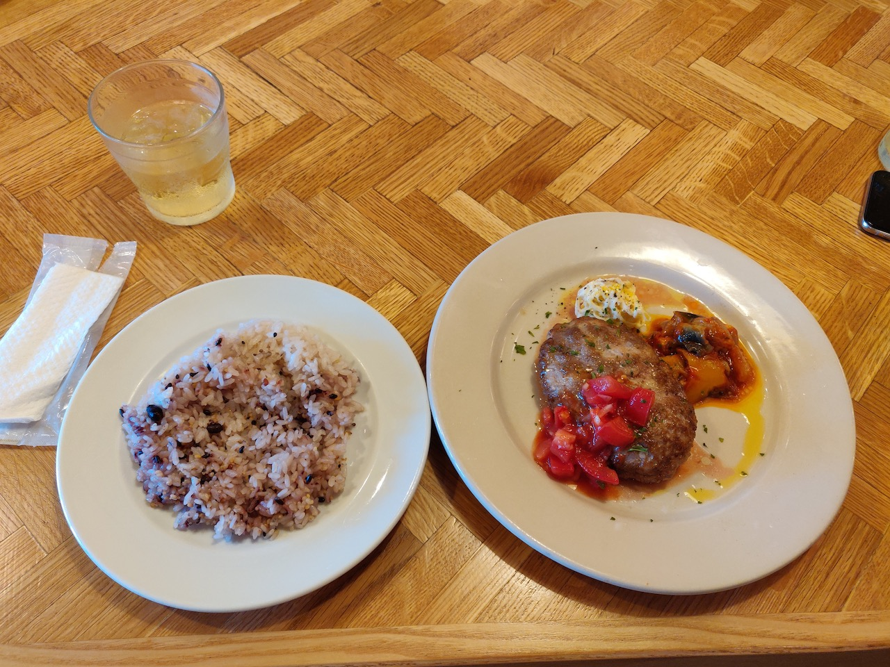
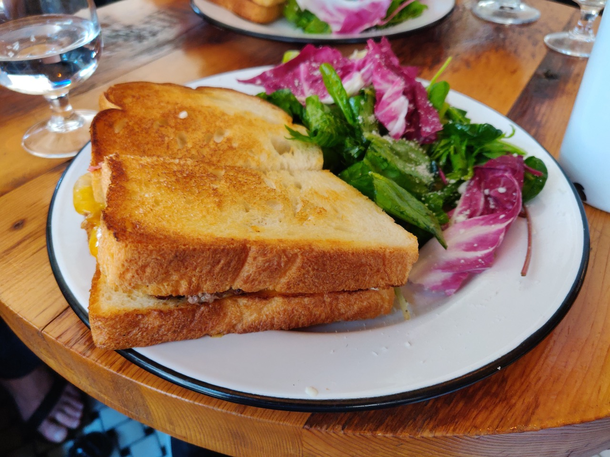

こんにちは、どら([@d0ra1998](https://twitter.com/d0ra1998/))です。
長かったテスト期間も終わり、待ちに待った夏休みということで早速 Wantedly のサマーインターンに参加してきました！

僕が参加したのは、**Web フロントエンドコースの Term 1** (8/5~8/16)です。2 週間いる中で感じた会社の雰囲気なども伝えていけたらと思うので、Web フロントエンドが得意分野の人もそうでない人も、最後まで読んでくれると嬉しいです。

## Wantedly ってどんな会社？

Wantedly では、主に

- 企業とユーザーを結びつけるビジネス SNS **「Visit」**
- 名刺をスマホで撮影して簡単に管理が行える **「People」**

の 2 つの軸で事業を展開しています。

(画像は[ウォンテッドリー株式会社 | 企業情報](https://wantedlyinc.com/ja)より)

## インターン何をしたの？

先述のプロダクトのうち、**Visit の企業側管理画面のリニューアル**を行うチームにお邪魔させていただきました。

現在、Wantedly Visit は巨大な Rails リポジトリからマイクロサービス化を進めているところで、フロントエンドは React 化が進められています。
今回触ったリポジトリは、およそ半年前に生まれたもので、比較的コードリーディングしやすかったのでとても助かりました。

まず初日にメンターの方に現在の技術構成や進捗状況を丁寧に説明していただき、その後に割振れるタスクを一緒に見て最初にやるタスクを決めました。ここに時間をしっかり割いてくださったので、最初から比較的スムーズに取りかかることができました。

2 週間で大小様々なタスクをやりましたが、カバーできていなかった E2E テストの実装や入力欄の性質に応じた文字数カウンターの表示改善などを主に手掛けました。1~2 日で終わるタスクを中心に振っていただいたので、毎日成果が見えてとても充実感がありました。

## 働く環境

### 開発サイクルが早い

Wantedly では、デザイナーの方との距離が近く、作成中のデザインの相談がエンジニアに持ちかけられることもあれば、エンジニアが実装中に気づいたデザインや仕様が曖昧だった部分をデザイナーに持ちかけたり、といった双方向のコミュニケーションがとても活発に行われていました。

実際、僕は UI/UX 周りの改善タスクを多く手掛けたので、担当デザイナーの方に自分で相談しにいったりしました。また、些細な UI の文言変更は、同じチームの外国人エンジニアに聞いて英語に違和感がないか確認したりしましたが、これも新鮮で楽しかったです。

### 風通しが良い

週 1 回全社員が集まる場があり、開発サイドや営業サイドなどのそれぞれの部署が現在進めていることの報告をする場が設けられています。

どうしても普段は目の前の開発のみを考えることが多いので、海外展開の状況や営業サイドとして行なっていることなどが知れて、なかなか興味深い場でした。

## 技術的に得られたこと

### GraphQL や Hooks をフル活用

サーバーとの通信は Apollo を用いて GraphQL で行なっており、GraphQL のクエリから TypeScript の型定義が自動生成されるのを体験した時には結構感動しました。
また、全面的に Function Component を使って書かれており、Hooks 周りを改めて深く理解するいいきっかけとなりました。

### グローバルなサービスをつくるということ

今回作成した募集作成画面は、日本以外の地域でも提供されることになっており、当然そのための対応が必要になります。いわゆる`i18n`ですね。

必要になる UI の言語切り替えについては、同じチームにいらっしゃった Camille さんが書いた下の記事のように`lingui.js`を使っていました。po ファイルで管理できるので、外部に頼むのにも便利そうです。

他にも、タイムゾーンを考えて日時周りを書いたり、各地域ごとの日付・曜日表示に対応したりと普段あまりしない経験ができました。

## 会社とその周辺の雰囲気とか

### オフィスが中も外も素敵

[Google マップにある 360° 写真](https://www.google.co.jp/maps/place/%E3%82%A6%E3%82%A9%E3%83%B3%E3%83%86%E3%83%83%E3%83%89%E3%83%AA%E3%83%BC/@35.6396908,139.7221555,3a,75y,80h,90t/data=!3m8!1e1!3m6!1sAF1QipOJ_qCMPL9n7L094lDYLT0C1LNd7T8g-mlr2whS!2e10!3e11!6shttps:%2F%2Flh5.googleusercontent.com%2Fp%2FAF1QipOJ_qCMPL9n7L094lDYLT0C1LNd7T8g-mlr2whS%3Dw203-h100-k-no-pi-0-ya169.9004-ro-0-fo100!7i13312!8i6656!4m5!3m4!1s0x35441d89d7421c9f:0xd7cd585ac9104934!8m2!3d35.639698!4d139.722177)を見るのが一番わかりやすいと思います。オフィスのすぐ隣が国立庭園になってるのも好きなポイントの 1 つです（昼休みにぷらっと行こうとしたら有料だったけど…）。

<iframe src="https://www.google.com/maps/embed?pb=!4v1566210718537!6m8!1m7!1sCAoSLEFGMVFpcE9KX3FDTVBMOW43TDA5NGxEWUxUMEMxTE5kN1Q4Zy1tbHIyd2hT!2m2!1d35.63969081671274!2d139.7221555209351!3f80!4f0!5f0.7820865974627469" width="900" height="500" frameborder="0" style="border:0" allowfullscreen></iframe>

### 白金台はいい街だけども…

オフィスは白金台にあるのですが、関東に住んだ経験のある方ならご存知、高級住宅街とかがある街なので生活コストは正直高めです。ただ**美味しいのは間違い無い**ので、最後に飯テロでもしておきます。

日によっては会社の方で出していただいたりもしたので、まぁ 2 週間程度ならせっかくなので、割り切って高級ランチを楽しみましょうｗ

(初日でテンパって写真忘れた…)

## これからインターン行く人へ

- 白金台駅前のドンキは飲み物・お菓子が安いので便利
- 夏場は暑いけど、目黒まで歩くと庶民的なレストランが多い(松屋もある！)
- ~~業務中に聞く声優ラジオを選んでおこう~~

## まとめ

2 週間とは思えない、非常に濃い充実したインターンになりました！

応募からインターン中まで都度気にかけてくれた人事の方、詰まったときに親身に助けてくださったメンターの方、交流ランチなどでご一緒させてもらった社員の方々に改めて感謝して、このエントリーを終わりにしたいと思います。

さて、今週末は DeNA のプロダクト開発インターンを頑張ってきます！

