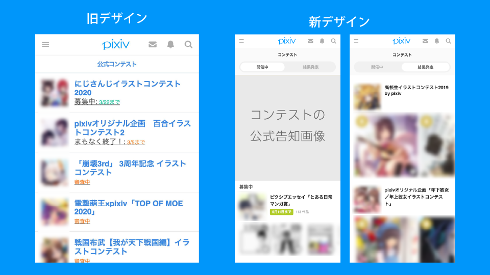

底冷えしていた京都も、徐々に暖かい日が増えてきました。どら([@d0ra1998](https://twitter.com/d0ra1998/))です。

さて、2/25 から 3/2 にかけて、pixiv の選考インターンに参加してきました。
僕が配属されたのは[モバイル版 pixiv](https://www.pixiv.net)で、行ったタスクや感想について書いていきたいと思います。

## 取り組んだタスク

今回のインターンでは、「まるっと 1 つ新しく SPA のページを作る」タスクを中心に取り組みました。

モバイル版 pixiv は、従来 php でレンダリングまでを行っていましたが、現在は徐々に Vue.js による SPA にシフトする形で開発が進められています。
今回は、[「公式コンテスト」ページ](https://www.pixiv.net/contest/)を、SPA にすると同時に新デザインに改修を行いました。

初めて Vue.js の大規模プロジェクトに触れることができ、ディレクトリ構造や Vuex ストアの設計、 Storybook の活用などについて知見を得ることができました。  
僕は[名前付きスロット](https://jp.vuejs.org/v2/guide/components-slots.html#%E5%90%8D%E5%89%8D%E4%BB%98%E3%81%8D%E3%82%B9%E3%83%AD%E3%83%83%E3%83%88)や[Get/Set ができる算出プロパティ](https://jp.vuejs.org/v2/guide/computed.html#%E7%AE%97%E5%87%BA-Setter-%E9%96%A2%E6%95%B0)とかが結構好きで、このインターンを通じて Vue.js やっぱ好きだな〜って思いました。

## 1 週間を通しての感想

### 大きなタスクに取り組ませてもらえる環境

インターンは 1 週間という就業型にしては短い期間だったので、行く前は「大した貢献ができないんじゃないかな…？」という不安も正直ありましたが全く杞憂に終わりました。  
もちろんタスクの大小でインターンの良し悪しが決まるわけではないですが、積極的に成果が残りやすいタスクに取り組んでもらおうという配慮が随所で感じられて、とてもありがたかったです。

同時期に春インターンの学生もたくさん来ていて、ランチなどで話す機会があり楽しかったです。

### デザイナーとの距離が近い

デザイナーさんと積極的に対話できる環境がとても気持ちよかったです。デザインの意図をしっかり聞けただけでなく、逆に迷っている部分について自分の意見も聞いてくださったり、双方向のコミュニケーションをたくさん取ることができました。

特に今回は新規ページの実装だったので、実装と並行してデザインの仕様を詳細に詰めていく必要があり、この距離感が近い環境があってこそ、無事完成できたと感じています。

## まとめ

1 週間と思えないぐらい、たくさんの学びがあったインターンでした。また、同時に pixiv の環境や雰囲気も存分に体感することができ、本当に行ってよかったです。

選考まで pixiv のインターンやイベントに参加したことはなかったのですが、選考の過程にインターンがあったことで、安心して本選考を受けることができました。短い期間でしたが、大変お世話になりました！
