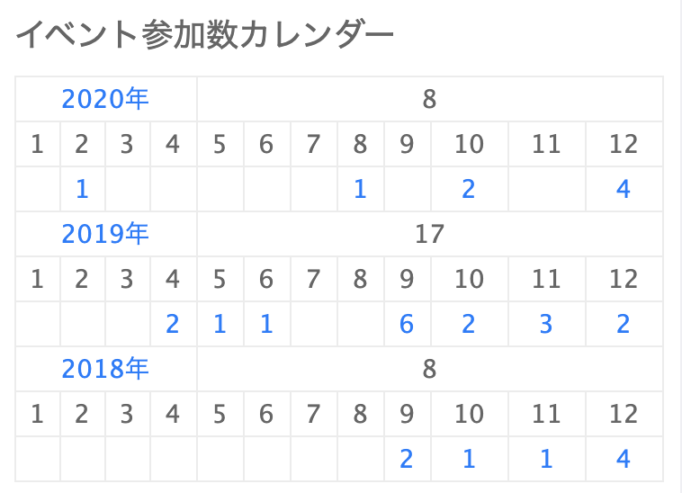

こんにちは、どら([@d0ra1998](https://twitter.com/d0ra1998/))です。  
早いもので、もうすぐ 2020 年も終わりですね（紅白を観ながら書いています）

2021 年をより充実した年にするために、ざっとではありますが 2020 年を振り返りたいと思います。

## LT やブログなどのアウトプット

今年は、20 分枠 1 本、10 分枠(LT)2 本の発表ができました。まだまだ数としては少ないですが、全くしてこなかった昨年までに比べれば、大きく成長できたと思います。

### CAMPHOR- DAY 2020

<iframe src="https://docs.google.com/presentation/d/1c67tm1ORmwba9mEDXFBGAoTfhUsrw2Kn_hs9GFxLpsQ/preview?usp=embed_googleplus" style="border: 0; top: 0; left: 0; width: 100%; height: 100%; position: absolute;" allowfullscreen scrolling="no" allow="encrypted-media"></iframe>

3 月に登壇した CAMPHOR- DAY では、CSS Grid について話しました。この頃は全然発表慣れしてなかったので、リハしたら 5 分以上尺が余ったり、20 分枠でもひいひい言いながらスライドを作っていました。  
このテーマは、styled-components と組み合わせて使う魅力を語った[このスライド](https://speakerdeck.com/terrierscript/styled-component-plus-css-grid)に感銘を受けて決めたものでした。普段 CSS をあまり書かない人を想定対象として、既存のレイアウト手法と比較しながら説明しましたが、使ってみたいと興味を持ってもらえてよかったです。

### うじまる生誕 LT

<iframe src="https://speakerdeck.com/player/acbf0eba08314077a932a5cfa7f6b495" style="border: 0; top: 0; left: 0; width: 100%; height: 100%; position: absolute;" allowfullscreen scrolling="no" allow="encrypted-media"></iframe>

なんか面白そうな気配を感じたので、ノリで登壇枠に登録しました。一人で前日に徹夜して作りましたが、めっちゃめちゃ楽しかったです。**SVG と Vercel の Serverless Functions** に少し詳しくなれたのでよかったです。

ちなみに、[「生活習慣の乱れを可視化するやつ」](https://midare.p1ass.com/)もこの LT 発祥ですね。最近の僕の生活習慣はこんな感じでした。12/24 から実家に帰ったので、明らかに寝る時間が早くなっててウケますね。来年こそ、もう少し規則正しい生活を頑張ります(本当に？)(まずはツイ廃をやめろ)

<blockquote class="twitter-tweet" data-dnt="true" align="center">
今年を振り返って<a href="https://t.co/omzJdeDzmh">https://t.co/omzJdeDzmh</a> <a href="https://twitter.com/hashtag/%E7%94%9F%E6%B4%BB%E7%BF%92%E6%85%A3%E3%81%AE%E4%B9%B1%E3%82%8C%E3%82%92%E5%8F%AF%E8%A6%96%E5%8C%96%E3%81%99%E3%82%8B%E3%82%84%E3%81%A4?src=hash&amp;ref_src=twsrc%5Etfw">#生活習慣の乱れを可視化するやつ</a>
&mdash; ど(∩❛ڡ❛∩)ら (@d0ra1998) <a href="https://twitter.com/d0ra1998/status/1344630919685029888?ref_src=twsrc%5Etfw">December 31, 2020</a></blockquote>

### ぷらす生誕 LT

<iframe src="https://speakerdeck.com/player/6743815502fb4bfcaba80bb203ab5fbd" style="border: 0; top: 0; left: 0; width: 100%; height: 100%; position: absolute;" allowfullscreen scrolling="no" allow="encrypted-media"></iframe>

またまた生誕 LT です。[うじまる](https://twitter.com/uzimaru0000)で味をしめた[たじまん](https://twitter.com/schktjm)が[ぷらす](https://twitter.com/p1ass)の生誕 LT も企画してくれました（ありがとう）。ぷらすくんは DJ が好き[要出典]なのと、ぼくの家には DDJ-400 があったので、Web MIDI API を使って遊んでみました。  
拍子抜けするぐらい簡単に使えて、メーカー公式で MIDI 仕様書も公開されているので、いい勉強になりました。ちなみに、**初めて Vite+Vue3 で作った SPA** でもあります。発表中に実演したら、特にターンテーブルでシークできるあたりがウケが良かったです。

### 記事執筆

ブログは、この技術ブログで 2 本、Qiita で 2 本、Zenn で 1 本でした。うーん、全然書けてないですね。

一方、note を始めて、主にポエムを書いていました。数本書いてみて、思ったより自分の過去に向き合ったり、思考の言語化ができて、いい取り組みだったなと思っています。その他、[ガジェットブログ](http://dorapocket.starfree.jp/)もアドベントに合わせてちょこちょこ書いたりしていました。

## インターン・アルバイト

### 3 月: pixiv 選考インターン

本選考の一環として、1 週間 pixiv の UI/UX チームでインターンさせていただきました。詳しくは[こちらの記事](https://blog.minoru.dev/2020/2020-pixiv-intern/)に書きましたが、自分が一番武器としていた Vue.js で思う存分新規実装をできたので楽しかったです。

結果として、内定をいただいたもののお断りしてしまいましたが、エンジニア皆さんが楽しそうに働いていたことはとても印象的でした。インターン中、アイマス好きの社員の皆さんとランチに行ったりしたのも良い思い出です。pixiv や BOOTH、FANBOX といったサービスには日々お世話になっているので、これからも何かご縁があれば嬉しいなと思っています。

### ~~XX 月: LINE インターン~~

後述する内定者バイトだけでも良かったのですが、「X 年 X 月以降に入社可能」の条件が珍しくないインターンだったので申し込んでみました。
**一度もコーディングテストを受けずに就活を終えてしまったので、なんとなくそのような経験を積んでみたかった**という気持ちが大きかったです。  
~~(CA の人事の方に話したら「心変わりして LINE 行ったりしないよね！？」って心配された)~~

2 回受けたのですが、**両方ともあっさりコーディングテストで落とされました**。悲しいね。やっぱり競プロ的な要素に極端に弱いことはわかったので、これからも精進したいと思います。  
受ける予定がある人は、ここら辺を見ておくと良いでしょう。あとは、慣れてる言語できちんとテストケースを自分で書いて試せる環境を整えておくと良いです。

### 8-9 月: AWA 内定者バイト

3 月に CyberAgent の内定を承諾して就活を終えたので、どこかでやろうと思ってた内定者バイトを夏休みにしました。コロナ禍の影響をもろに受けて、当初は実家から出社するつもりでしたが、京都からフルリモートになりました。

AWA の PC/Web チームとは、去年の[ABEMA でのインターン](https://blog.minoru.dev/2019/2019-summer-intern-abema/)の際に、なんとなく興味があったのでランチをセッティングしていただいたのが始まりでした。  
フルリモートで新しい関係が築きづらい環境下でしたが、このような接点があったからこそできた内定者バイトだったと思います。[「初めて就業型インターンに行く人へ贈る 5 つの Tips」](https://note.com/dora1998/n/n8dd06509d770)でも書きましたが、本当に活かせる機会には乗っかって、つながりを広げていくべきだなと実感しました。

業務内容としては、あまり言えることは多くないのですが、Web フロントエンドをガッツリやっていました。周辺環境の整備などにも取り組ませていただけて、[storycap](https://github.com/reg-viz/storycap)の導入をしたりしました。困ったときに実装を見たり、issue を立てたりする姿勢が身について良かったです。  
また超大所帯だった ABEMA とは対照的に、極めて少数精鋭のチームだったので、また違った動き方ができて楽しかったです。メンバーの方とはそれなりに歳の差がありましたが、真剣に僕の提案を聞いてくださり、また的確なアドバイスをたくさんくださって、本当にいい環境でした。  
来春の配属を思いながら、役割が決まりすぎていない少数のチームの方が、僕は気持ちよく働けるかもなと思ったりしました。

週 5 でフルタイムの勤務だったので、もちろん業務は楽しんでましたが、ずっと孤独でデスクに向かうのはしんどい場面もちょいちょいありました。休みの日に遠方のエンジニア友達が京都に遊びに来てくれたり、晩ご飯だけサクッと友人と食べに行ったりすることでかなり精神的に回復したので、春からフルリモートになったとしても感染リスクを抑えながらうまく人とのつながりを保ちたいです。

### 通年: 京大マップ

初めてのエンジニアバイトでもある京大マップも、今年で関わり始めて 3 年目になりました。  
まもなく卒業に伴って離れてしまいますが、その前にちゃんと[Web 版](https://web.kyodaimap.net/)をリニューアルできて良かったです。

リリースはしましたが、まだまだ改善点は多くあるので引き続き取り組んでいきたいです。

### 10 月-: Botlogy

CAMPHOR- に遊びに来ていた洲脇さんに声をかけられ、10 月から Botlogy というプロダクトの開発にジョインしました。実は Firebase や LIFF をフルに使ったアプリケーションの開発はあまりしたことがなく、最初は苦戦しましたが今では楽しく開発しています。

ベンチャーである故の裁量の大きさや勢いが気に入っています。まだまだ入りたてですが、もっとコミットしていきたいです。

## 大学など

### 卒業研究

京大工学部電気電子工学科では、B4 の春に研究室配属があります。第 7 希望まで提出すると、謎のアルゴリズムで成績ジャンケンされるのですが、興味が持てないことは本当に勉強できないポンコツで有名な僕が第 7 希望までに収まるはずもなく、余った研究室から選ぶことになりました。

<blockquote class="twitter-tweet" data-dnt="true" align="center">
万　策　尽　き　た <a href="https://t.co/4udfdcrYog">pic.twitter.com/4udfdcrYog</a>
&mdash; ど(∩❛ڡ❛∩)ら (@d0ra1998) <a href="https://twitter.com/d0ra1998/status/1236954544111677441?ref_src=twsrc%5Etfw">March 9, 2020</a></blockquote>

<blockquote class="twitter-tweet" data-dnt="true" align="center" data-conversation="none">
配属プログラムバクってない？デバッグしようか？大丈夫？？？？ねえ？？？？？？？？？？？
&mdash; ど(∩❛ڡ❛∩)ら (@d0ra1998) <a href="https://twitter.com/d0ra1998/status/1236954637476851713?ref_src=twsrc%5Etfw">March 9, 2020</a></blockquote>

元々情報学科に落ちて入学した経緯もあり、電気電子工学科の授業も興味が持てるものがあまりなく本当に辛かったので、研究室まで情報系に引っかからなかったのはかなり応えました（まぁ客観的に見れば自業自得）。

<blockquote class="twitter-tweet" data-dnt="true" align="center">
答え合わせは一年後
&mdash; ど(∩❛ڡ❛∩)ら (@d0ra1998) <a href="https://twitter.com/d0ra1998/status/1237078264071389184?ref_src=twsrc%5Etfw">March 9, 2020</a></blockquote>

当時はこんなことを書いていましたが、なんとか年末の中間発表までに半分ぐらいは書いたので、もう一踏ん張りしてしっかり卒業はしたいと思います…。

### CAMPHOR- の運営

昨年に引き続き、CAMPHOR- の運営メンバーをしていました。今年は会計という役職に就き、予算管理や会計処理などを行いました。
コロナの影響で HOUSE の通常会館もままならない時期もあり、CAMPHOR- というコミュニティを金銭面で維持する役目を全うするのはとても大変なことでした。

**どれだけ崇高な理想を掲げて、素晴らしいメンバーを揃えても、活動していくための資金が底をつけば、あっという間にコミュニティの灯火は消えてしまう。** そんな危機感が常に頭にあった年でした。
幸いにして、感染対策をしながらイベントを開いて協賛をいただき、次の世代へと引き継ぐことができました。本当にありがたいことです。

コミュニティとしての今年の統括は下の記事にあるので、是非読んでみてください。

## 趣味・娯楽

ライブを楽しみに日々生きていた僕にとって、コロナによるダメージは本当に大きなものでした。3 月初め頃からチケットを取っていた公演が次々と中止になり、イベンターノートを見ても空白期間がはっきりとわかります。

今年後半にカウントされているイベントはオンラインのものが多かったですが、先日「京 Premium Live」で久々に現地に足を運んで、声援が送れない中でも一体となって飛び跳ねて盛り上がって、この体験こそが"ライブ"だよなと実感しました。

他人には不要不急と言われても自分には大切なものが誰しもあると思いますが、それが僕にとってはこのライブという体験であると改めて感じた年でした。

## 2021 年に向けて

ここまで長々と読んでくださり、ありがとうございます。  
2021 年の抱負は、また別記事で書きたいと思いますが、今年よりさらに飛躍できる良い年になるように努力したいと思います。

それでは皆さん、良いお年を！
