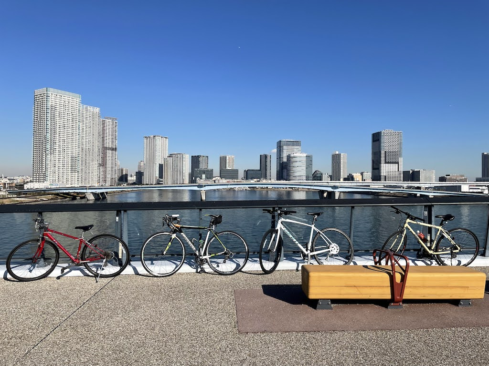
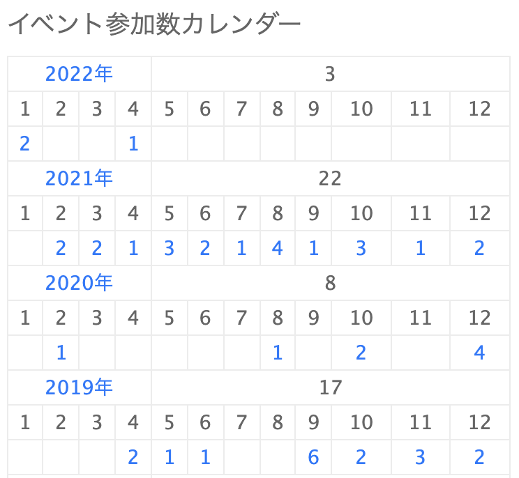

こんにちは、どら([@d0ra1998](https://twitter.com/d0ra1998))です。
あっという間に 2021 年も終わろうとしているので、今年をざっと振り返りたいと思います。

## 仕事

4 月から株式会社サイバーエージェントに新卒入社しました。1 ヶ月程度の研修の後に、希望通りメディア事業への配属が決まりました。[去年の振り返り](/2020/20201231-2020-furikaeri/)で書いていた

> 役割が決まりすぎていない少数のチームの方が、僕は気持ちよく働けるかもなと思ったりしました。

この希望をひたすらに言い続けていたら、社員が僕含め 3 人のチームに配属となってまさに夢叶ったりという感じになりました。希望を伝え続けるの大事。

最近仕事をしていて思うのは、サービスをつくるエンジニアにとって**実装以外の時間の大切さ**です。仕様に考慮漏れはないか、曖昧な記述で他職種と認識に齟齬がある部分はないかといった基本的なところに始まり、そもそもその施策で当初の目的は満たせそうかエンジニア目線で考えてみるなど、各所ときちんと連携をとって初めて施策が完遂できるのだということを実感しました。技術力を高めることももちろん大事ですが、職業エンジニアとしてのトータルでの戦力もさらに高めていきたいと思った 1 年でした。

新卒 1 年目として学ぶことはもちろんまだ多いですが、内定者バイトのトレーナーをしたり学生と面談したりと積極的にいろんな機会をいただけているので日々楽しくやれてます。特にトレーナー業務は、今まで自分がインターン生や内定者バイトだった頃にしていただいたことを見つめ直すいい機会でした。

特に 1on1 を行う側に初めてなったので、改めてこのキャリアパス本を読み返したりしました。今後なりうるキャリアパスが比較的網羅されてるので、これからもこの本は定期的に読み返したいです。

そのほか、採用イベントにも 1 件出演したりしました。結局就活記事は書きそびれてしまったので、対外的にちゃんと話すのは初めてだったかもしれないです。

## 技術的なアウトプット

もともと積極的な方ではなかったですが、慣れない生活を言い訳に今年は特に何もできなかったなーという印象が強いです。
ただ、年末に microCMS の記事を上げたら思ったより反応もらえて嬉しかったのと、自分が別のプロジェクトで同様に取り組むときに読み返したいとも思えたので、来年こそもっと積極的に発信していきたいです[^blog]。

OSS 活動については、仕事をしながら気になった部分には躊躇なく issue や PR を立てられるようになったという点で一歩成長できたかなと思います。来年からはもう一歩踏み込んで、自分が author のライブラリを作ったり、何か一つガッツリ contribute するライブラリができればいいなと思っています。

特に [falco](https://github.com/ysugimoto/falco) については、コードリーディングを通じて言語処理の仕方などを垣間見ることができてとても勉強になりました。

## 生活

### お金

学生の頃は正直入ったお金は全部使い切るぐらいの浪費っぷりだったのですが、社会人になって流石に自分の身は自分で守らねばまずいと思い、節制を身につけようと努めた 1 年でした。

相変わらず趣味への出費の多さは人に話すたびにどん引かれますが、とりあえずつみたて NISA と持株会、来年からは iDeCo も加えて、自動で年 100 万ぐらいは貯まっていく生活ができてきたので良しとしています。

### 健康

入社前と比べ、**3 kg 太りました**。主に「人とうまい飯を食べて交流する」ことに経費を出してくれる弊社のおかげです。このまま線形に増加すると、10 年以内に 100kg 近くになってしまうのでかなり危機感を感じています…[^joke]。

リングフィットは引き続きゆるっと続けています…が、それだけでは抑えられないと思うので考え中です。ランニングとかできるといいですが、服とか靴とか調達するところから考えると億劫になっちゃうんですよね…。とりあえず最近はたまに徒歩通勤してお茶を濁しています。

先日渋谷からお台場まで同期とサイクリングしたらかなり楽しかったので、来年はもっとチャリ漕ぐのも良いかなと思ったり。

## 趣味

### ライブ

コロナ禍も長期戦に入り、対策をしつつライブをやる足場ができてきたこともあってたくさんライブに行きました。オンライン視聴も含めての数ではありますが、コロナ前の 2019 年よりも行ってたようです。

またこれは別で書きたいと思いましたが、このような趣味をする上で改めて東京生活は最高です。

### 旅行

社会人になり平日の自由度は減りましたが、比較的たくさん行けました。引き続きできる感染対策はしつつ、来年もいっぱい行きたいです。

- 金沢 & 和倉温泉
- 山梨
- キャンプ（山梨・静岡）
- 京都

## まとめ

色々課題はあるものの、まぁ健康に楽しく毎日働けている時点でとりあえず合格点じゃないでしょうか（甘々  
技術的なアウトプットとかは、今後社外含めて自分の価値を高めていくために必須だと思うので年始に目標を立てて改めて頑張っていきたいと思います。

それではみなさん、良いお年を！

[^blog]: マジで毎年言ってる気がする。このサイト構成とかにいまいち納得いってないのが大きいんだけど、一向に改修する気にならなくて難しい…。
[^joke]: 流石にこれは冗談だけど、遺伝的に太りやすい体質ではあるのでなんとかしたい。
