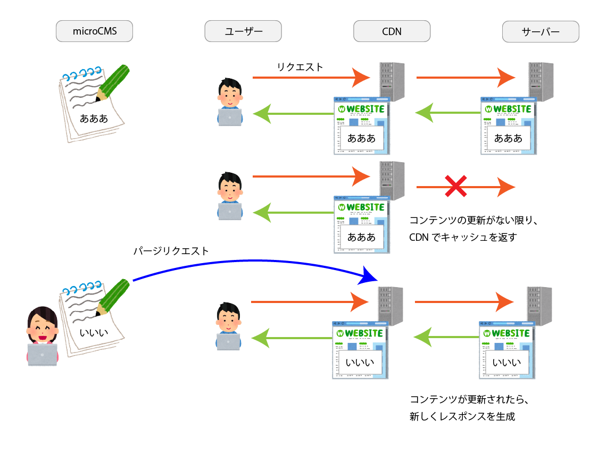

この記事は [microCMS Advent Calendar 2021](https://qiita.com/advent-calendar/2021/microcms) 24 日目の記事です。

今回は SSR をしている Web アプリケーションで、microCMS の更新時に CDN キャッシュを破棄する仕組みを紹介します。

## 前提

microCMS には、[更新時に Webhook で通知を送る機能](https://document.microcms.io/manual/webhook-setting)が存在します。通知先は自由に選択できます。例えば

- Slack やメールで更新通知を受け取る
- Netlify、AWS Amplify でビルド
- GitHub Actions で任意のワークフローを実行

などの用途が想定されています。

これに今回は CDN の一つである Fastly を組み合わせます。Fastly は、優れたパージ機能を特徴とする CDN で、[平均 150ms](https://www.fastly.com/jp/edge-cloud-platform)でキャッシュのパージを行うことができます。パージは全てのページに対して行なう方法や、URL を指定する方法の他に、ページごとにレスポンスにつけた `Surrogate-Key` ヘッダをもとに行うこともできます。

これらを組み合わせ、極力レスポンスをキャッシュで返す状態を作ることで、アクセス数に対して必要なサーバーリソースが最小限で済み、突発的なアクセス増などにも対応しやすくなるメリットがあります。

なお、本記事では GitHub Actions を用いていますが、Webhook を経由して実行できれば他の CI でも応用することができます。

## 今回実現したいこと

コンテンツを更新し、CDN のキャッシュがパージされるまでのフローを下図に示します。



TTL を 14 日間など長めに設定し、コンテンツに変化がない間は同じキャッシュを返すことで、オリジンサーバーへリクエストが到達する機会を最小限に抑えます。CMS でコンテンツが更新された際は、影響するページのみキャッシュをパージすることですぐに更新結果を反映できます。

なお、ここに書いたコンテンツ更新時以外に、デプロイ時にも全ページのキャッシュをパージしています。

## Surrogate-Key をページに付与する

キーを指定してキャッシュをパージするためには、CMS のコンテンツを使用している対象ページのレスポンスヘッダに `Surrogate-Key` を付与する必要があります。`Surrogate-Key` ヘッダは以下のような形式で表現することができ、タグと同じ感覚で複数のキーを持たせることができます。

```
Surrogate-Key: key1 key2 key3
```

例えば、microCMS で「更新情報」と「ブログ記事」の 2 つのコンテンツを管理しているサイトを想定します。トップページでは更新情報一覧と記事一覧、記事詳細ページでは記事 1 つの詳細を取得しているとした場合、 Surrogate-Key ヘッダは以下のように設定できます。

- ブログトップページ(/): `update-info article`
- 記事ページ(/articles/foobar): `article/foobar`

## microCMS の変更をトリガーに GitHub Actions を呼び出す

まず、microCMS から通知を受ける GitHub Actions の workflow を用意し、どのような payload が渡ってくるか確認してみます。

Webhook を経由して workflow を実行する場合、`repository_dispatch` というイベントをトリガーとする必要があります。`repository_dispatch` のイベントが呼び出される場合 `github.client_payload` に呼び出し元が提供する情報が入ります。これをスクリプトに渡す workflow は以下のようになります。なお、スクリプトの詳細については次の章で解説します。

```yaml
name: Purge Fastly Cache

on:
  repository_dispatch:
    types: [cms_updated]

  jobs:
    purge_fastly_cache:
      runs-on: ubuntu-20.04

      env:
        FASTLY_TOKEN: ${{ secrets.FASTLY_TOKEN }}
        FASTLY_SERVICE_ID: ${{ secrets.FASTLY_SERVICE_ID }}

      steps:
        - uses: actions/checkout@v2

        - uses: actions/setup-node@v2
          with:
            node-version-file: ".node-version"

        - name: Purge Fastly Cache
          run: npx zx scripts/purge-microcms-cache.mjs '${{ toJSON(github.event.client_payload) }}'
```

次に、microCMS で Webhook の設定を行います。各コンテンツごとに「API 設定」を開き、Webhook として GitHub Actions を追加します。このとき、「トリガーイベント名」には `on.repository_dispatch.types` で記述したイベント名（先程の例だと `cms_updated` ）を入力します。
設定後にコンテンツを更新すると、以下のような payload とともに GitHub Actions が実行されます。

```json
{
  "api": "article",
  "id": "foobar",
  "service": "my-blog",
  "type": "edit"
}
```

このデータ形式は、microCMS が GitHub Actions と連携できるようになった旨の[公式アナウンス](https://blog.microcms.io/webhook-for-github-actions/)にて解説されています[^webhook-payload]。

ここまでで、microCMS の更新を起点に GitHub Actions で更新内容を受け取ることができました。次に、受け取った更新内容を元に Fastly のパージを行なっていきます。

## パージスクリプトを準備する

パージスクリプトは CI 上で動作すればどんな言語で書いても良いですが、今回は JavaScript を選択しました。更新内容をもとに該当ページのキャッシュをパージするスクリプトは以下のようになります。

```js
const SurrogateKey = {
  UPDATE_INFO: "update-info",
  ARTICLE: "article",
};

function surrogateKeys(api, id) {
  switch (api) {
    case "update-info":
      return [SurrogateKey.UPDATE_INFO];
    case "article":
      return [SurrogateKey.ARTICLE, `${SurrogateKey.ARTICLE}/${id}`];
    default:
      return [];
  }
}

const { FASTLY_TOKEN, FASTLY_SERVICE_ID } = process.env;
const payload = JSON.parse(process.argv[process.argv.length - 1]);

fetch(`https://api.fastly.com/service/${FASTLY_SERVICE_ID}/purge`, {
  method: "POST",
  headers: {
    "Fastly-Key": FASTLY_TOKEN,
    "Surrogate-Key": surrogateKeys(payload.api, payload.id).join(" "),
  },
});
```

余談ですが、キャッシュパージ用のスクリプトに [Google が開発している zx](https://github.com/google/zx) を採用しましたが、以下の点が特に良かったです。

- `yarn install` を必要とせず `npx zx script.mjs` のワンコマンドで便利関数が揃った環境で実行できる
- fetch 関数などがデフォルトで実行内容を出力してくれるため、CI 上でデバッグしやすい

Webhook には、コンテンツの並び替えや複数項目を連続して公開した際に高頻度で通知が送られます。コンテンツ編集者は早く変更が反映されることを期待するでしょうし、CI のキューがたまらないようにするためにも、短時間で処理できるように設計することが重要です。

## まとめ

今回の記事では、Fastly のパージ機構を microCMS のコンテンツ更新と組み合わせて、効率の良いキャッシュ戦略を実現する方法について紹介しました。

実際にこの仕組を用いて開発した Web アプリケーションでは、コンテンツを更新してから 10 秒程度でサイトに反映され、快適に運用できています。また、ほとんどのリクエストは CDN からキャッシュで応答できるため、エンドユーザーから見たパフォーマンスも優れたサイトにすることができました。

頻繁に更新が発生するサイトやコンテンツ量が多いサイトなどで是非試してみてください。

[^webhook-payload]: [ヘルプ](https://document.microcms.io/manual/webhook-setting#hf0d425ae06)には 2021/12/24 時点で掲載されていないので、注意が必要です。
