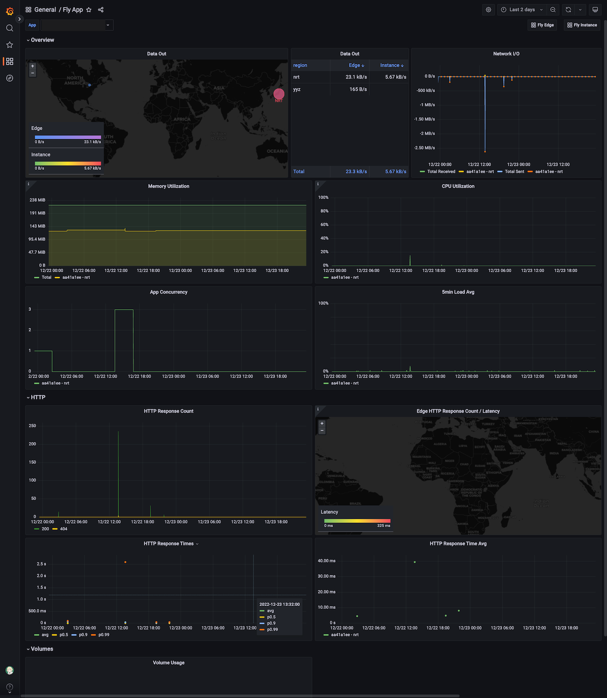

これは [CAMPHOR- Advent Calendar 2022](https://advent.camph.net/) の 23 日目の記事です。

つい先日の 2022/11/28 に、Heroku の無料プランが廃止されました。経緯は以下のサイトにありますが、当然ながら Heroku も慈善事業ではないので致し方ない感があります。

しかし、それでも雑に無料でホスティングできる環境に置いときたいことは特に個人開発だとままあります。今回は無料枠があるホスティングサービスである [fly.io](https://fly.io) を試してみたので、主に Heroku と比較しながら感想を軽く書き残したいと思います。

## 良かったところ

### 東京リージョンが選べる

Heroku では[Private Space として東京リージョンが提供されている](https://devcenter.heroku.com/ja/articles/regions)ものの、費用を抑えるには US or EU リージョンを選ぶことが必須でした。
そのため、国内からアクセスするとしばしば応答時間が気になることがありました。

その点、fly.io は料金プランに関わらずかなり多くのリージョンが選択でき、東京リージョンも選ぶことができます。

ただし、データ転送量のみリージョンによって無料枠と値段が異なっており、US/EU リージョンであれば月 100GB 無料で転送できるのに対し、東京リージョンは月 30GB になってしまう点には注意が必要です。
それでもアクセス頻度が低いアプリを置いておく分には十分ですね。

| リージョン                                   | 無料枠   | 超過料金 |
| -------------------------------------------- | -------- | -------- |
| North America, Europe                        | 月 100GB | $0.02/GB |
| Africa, Asia Pacific, Oceania, South America | 月 30GB  | $0.04/GB |
| India                                        | 月 30GB  | $0.12/GB |

### HTTP 2 に対応

Heroku では HTTP 1.1 までの対応でしたが、fly.io は HTTP 2 で配信することができます。

### メトリクスが Grafana で見れる

デプロイすると、ダッシュボードで簡易的にメトリクスが見れるほか、Grafana で詳細に期間等を指定してみることができます。
集計項目のカスタマイズは行えなさそうですが、CPU/メモリの使用率や HTTP レスポンスの 2xx,4xx,5xx のカウントや応答時間など一通りが慣れている Grafana で見れるのはとても良かったです。

また、Prometheus サーバーにもアクセスできるようになっているため、Grafana を運用している場合はそちらにデータソースとして追加することも可能です。

## 惜しいところ

### CI/CD の面倒は基本見ないっぽい

Heroku では GitHub と連携することで、デプロイプレビューがあったり main ブランチにマージしたらデプロイされたりと、CI/CD を自分で書かなくても用意できるのが大きな利点でした。
その点、fly.io は`flyctl` コマンドのみをデプロイ方法として提供しており、GitHub Actions のワークフロー例を示すにとどまっています。

Heroku から直接移行できる [Turbocharge](https://fly.io/launch/heroku) を公開しているだけに、ここら辺まで含めて丸っと移行できるといいのになーとは思ってしまいます。
ただ、先日 Heroku の GitHub Apps については、OAuth トークンが盗まれるインシデントもあったので、fly.io は連携アプリを管理したくないのかもしれないですね。

### アプリケーション以外の Postgre や Redis は有料

以前の Heroku では Postgre や Redis に関しても無料プランがありましたが、fly.io では特にそちらの無料枠は用意されていないようです。
スケールさせない個人アプリであれば、最近なら [Litestream](https://litestream.io/) とかを活用して SQLite 等で済ませても良さそうです。

## おわりに

Vercel や Cloudflare Pages など、静的サイトのホスティング先は豊富な反面、常時建てておきたいサーバーを気軽にデプロイする選択肢は最近意外と少なくなっているなと改めて感じました。
Cloud Run といった選択肢もありますが、プロジェクト作成の手間などを考えると fly.io の気軽さは個人開発に相性が良さそうです。

