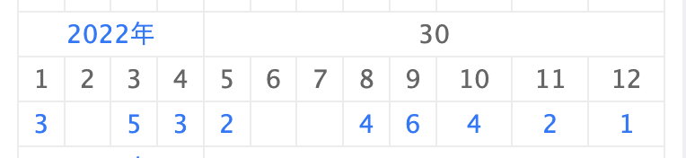

こんにちは、どら([@d0ra1998](https://twitter.com/d0ra1998))です。
今年は振り返り記事を書くのは諦めようと思っていましたが、先日以前の振り返りを今見ると懐かしい気持ちになれて良かったのでやっぱり書くことにしました。

## 仕事

仕事は引き続き株式会社サイバーエージェントで、競輪・オートレースのインターネット投票サービス「WINTICKET」の Web フロントエンド開発を中心に行なっていました。

### Web Speed Hackathon 2022 の作問をした

Web パフォーマンス改善のコンテスト「Web Speed Hackathon 2022」の作問をしました。前回(2021 年)社内向けに開催された時に優勝したことがきっかけで担当することになりましたが、問題を解くことに比べて問題を作ることはより網羅的な知識やどう問題に落とし込むかが求められるので、なかなか難しかったです。

他にも色々語れることはありますが、いずれ話す機会もありそうなのでここらへんで。

### テックリードになった

入社当初からテックリードを将来のキャリアパスとして伝えていたこともあり、晴れて今年の 10 月から Web チームのテックリードとなりました。
まだまだ役割を全うできているとは言えないですが、やりたいことがやれる環境にあるというのは本当にありがたいことです。

実際になってみて、これからどういうテックリードになりたいのか、またさらにその先はどういう自分になりたいのか、という部分の解像度を上げる必要が出てきて、あわあわしてはいますが、来年再来年あたりでここに自分なりの回答ができたらいいなと思っています。

### トレーナー業をいっぱいした

昨年初めて経験したトレーナーでしたが、今年は 4 人の内定者バイトや仮配属の新卒のトレーナーをそれぞれ 1-3 ヶ月ほど担当しました。どんな方が来るかわからない、自分が全うできるか、みたいな不安や緊張は今も昔もありますが、以前よりはだいぶ落ち着いてできるようになった気がします。

また、並行して新卒のトレーナーを 1 年間担当することとなり、長期に渡って一緒に考え成長を支えるのは大きな挑戦でした。しかし、自分が新卒 1 年目にトレーナーの支えがあってこそ成長できたなと思う節もあるので、責任感を感じながらも引き続き頑張りたいなと思います。

## プライベート

### ファッション系 YouTuber を見始めた

以前から服選びに自信がなく、それでも必要なのでお茶を濁しながら買っていましたが、東京に引っ越してから以前のようにイオンモールや三条四条を適当に歩いて買うのが難しくなり、ユニクロや GU しか行かなくなったので流石にこれはいかんと思って YouTube チャンネルをいくつかみはじめました。

今までは個別に雰囲気で選んでいましたが、よくある組み合わせや組み合わせやすいアイテムなどが体系的に知れて勉強になりました。

流石に社会人にもなると面と向かってダサいと言ってくる人は良くも悪くもいませんが、おしゃれだねって言われることが(当社比)増えて少し自信がついて良かったです。最近は green label relaxing がお気に入りです。

### マンション購入について調べて一旦やめた

今の家から次引っ越すにあたり、賃貸だけでなく中古マンションの購入も選択肢になるのではないかと、[cowcamo](https://cowcamo.jp/)をみたり、リノベを手がける[つじぽよさん](https://www.instagram.com/poyostagram0213/)さんのインスタを参考に、住宅ローンの仕組みや物件の選び方などを一時期調べていました。

結果としては、フルでローンを借りるにしても 1-200 万の現預金はあったほうが良いことや、まだ数年後の収入すら予測できないので今借りれる予算で考えるのはもう少し待っても良さそうなことなどから見送りましたが、これで準備もできるので知識として調べてよかったなとは思っています。今後の住宅ローン金利も読めないところではありますが、またの機会にリベンジしたいです。

### デスクを新調した

入社当初からずっと新調したかったデスクを買いました。[FlexiSpot E7](https://amzn.asia/d/0SR9lXQ) + [かなでものの天板](https://kanademono.design/products/tt-k03-na)という組み合わせで、とってもよくみるガジェット YouTuber そのまんまみたいな構成なのが悩みですが、とても満足しています。

### コーヒーを淹れるようになった

親から誕生日にコーヒーミルやマキネッタをもらったのをきっかけに、自分で豆を買って淹れるようになりました。奥が深くて面白いです。

## 趣味

### ライブ

今年もいっぱい行きました！特に Vaundy や yama はライブに行ってもっと好きになりました。イベンターノートに全部記録してるので、行ったライブは[こちら](https://www.eventernote.com/users/dora1998/events/?year=2022)から見れます。

ただ、楽しみにしていた初のアニサマは、当日に胃腸炎にかかり 2 日ともチケットを無駄にしてしまい残念でした。

アメックスの[キャンセル・プロテクション](https://www.americanexpress.com/ja-jp/benefits/insurance/nac-insurance/cancel-protection/)もこういう単純な体調不良では使え無さそうで悩ましいです。

### アニメ

毎クール幾つか観てましたが、特に記憶に残った 5 つを選ぶとしたらここらへん。

- ぼっち・ざ・ろっく
- リコリス・リコイル
- 白い砂のアクアトープ
- パリピ孔明
- 明日ちゃんのセーラー服

「ぼっち・ざ・ろっく」「パリピ孔明」「明日ちゃんのセーラー服」あたりは劇中ソングがクオリティ高く、どっぷりハマる大きな要素だったなーと思います。「白い砂のアクアトープ」は、「色づく世界の明日から」と同じような P.A.オリジナルで、奇をてらった物語じゃないけど美しさが感じられて好きです。

### ドラマ

久々に地上波ドラマを見たりしました。小学生の頃は毎クールたくさん見てましたが、また来年からはぼちぼち見たいです。

- silent
- アトムの童
- 恋なんて、本気でやってどうするの？
- 大豆田とわ子と三人の元夫

silent は家族や同僚と感想を共有できて楽しかったので、見たことある作品あれば教えてください。ぜひ語りましょう！

### 映画

- すずめの戸締まり
  - 入場特典がパンフ並みでびっくり。メッセージ性が強かったが、見た後の爽快感という意味で個人的には「天気の子」や「君の名は。」のほうが好きかな。
- 映画 オッドタクシー イン・ザ・ウッズ
  - アニメの続編ではなく別切り口でまとめた映画でしたが、予想以上に面白かったです。
- 映画 五等分の花嫁
  - 漫画を最後まで読めてなかったので、結末まで知れて満足。お幸せに。
- バブル
  - 「超高級食材の味噌煮込み」と表現していた知り合いの方がいましたが、まさしくそれでした。個々の要素は何も悪くないのになぜこうなったのか…w
- 恋する惑星 4K
  - 吉祥寺のシアターで観ました。最後まで不思議な世界観だった。
- 桜のような僕の恋人
  - 余命 10 年と似た筋書きではあるけど、ラストが本当に切ない。
- 余命 10 年
  - ストーリー展開が全て読めてしまったので若干単調でした…

だいたいアニメか恋愛映画を観てました。ネトフリも契約してましたが、やっぱ映画は映画館で時間を決めて鑑賞するのが好きです。

## 終わりに

2023 年も頑張るぞ！

