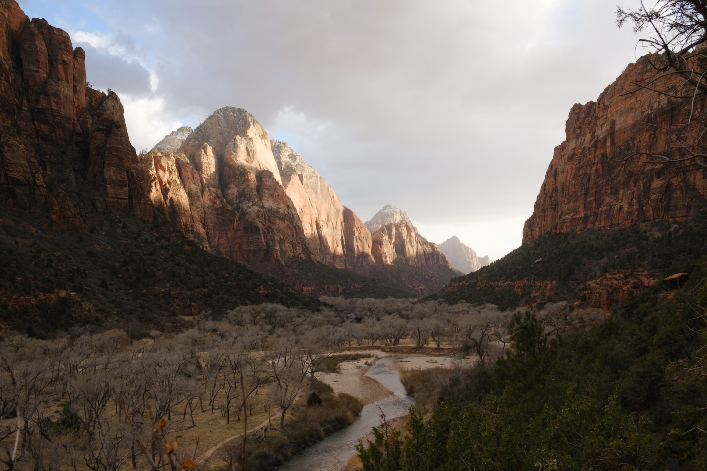
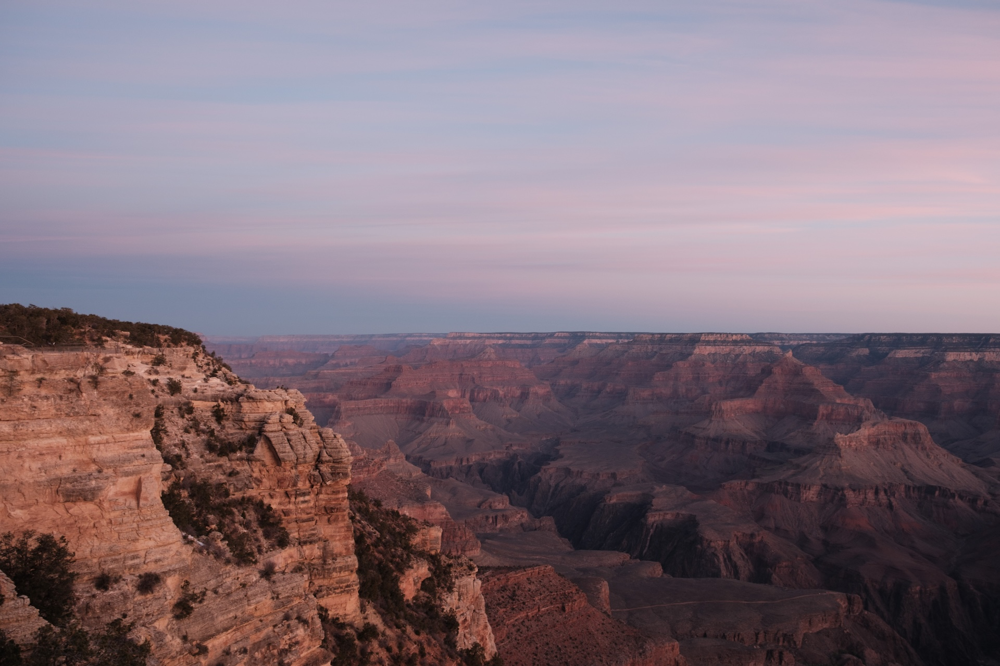

久々に 1 年の振り返りを書きたいなと思い立ってブログを見たら、なんと前回書いてから 3 年経っていました。
今年ももう終わるので、2025 年を振り返っていきたいと思います。

## 仕事

### 新規立ち上げを経験した

2 月から 5 月の約 4 ヶ月間、ゲーム事業で新規サービスを立ち上げるために期限付きで異動していました。

新卒からいる今の部署でテックリードやマネージャーも経験する中で、今後のキャリアをどうして行こうか考えていたタイミングで話をもらったのでほぼ即決でした。
入社から約 4 年が経つ中で、とても充実していましたが、異なる環境に行ってもちゃんと成果を出せるか頑張ってみたいと思ったのが主な理由です。

技術面では、Next.js や Panda CSS といった技術を実践導入で試すことができ、Server Components の良さや設計の難しさをようやく体感として身につけることができました。
負荷試験で Server Components やプリフェッチの挙動をシナリオでどう扱うか悩んだり、dd-trace を入れたら Node.js のバグを踏んで突然死する症状と格闘したりしたのも良い思い出です。
また、これまで熱心に取り組んできた CI/CD やクラウドインフラ、コードレビューあたりで特にチームに貢献できたかなと思っています。

そして、ゲーム事業で Web メインのサービスを提供するのは比較的珍しいこともあり、開発しながら Web というプラットフォームの特性に思いを馳せた時期でもありました。
当時はブラウザ標準の挙動を踏まえて、Web サービスとはこういう挙動をするべきだという考えが強かったですが、今振り返ればプロダクトの特性に合わせてもっと柔軟に捉えても良かったなという反省はあります。

組織面では、これまで後輩しかいないとても若いチームで開発していましたが、打って変わって、社歴 15 年以上の先輩や業務委託の方もいる多様なメンバーとの開発でした。
アニメーションが抜群に得意なメンバー、当時流行りはじめだった Agent Coding をいち早く実践していたメンバー、どんなタスクもとにかく安定感を持って遂行するメンバーなど、多様なメンバーで支え合えたのが何より楽しかったなと思います。

この異動の話は会社の Podcast でも話しているので、よければ聞いてもらえると嬉しいです。

<iframe data-testid="embed-iframe" style="border-radius:12px" src="https://open.spotify.com/embed/episode/5X1bz04gNgQlAbbjGDLvxT?utm_source=generator" width="100%" height="152" frameBorder="0" allowfullscreen="" allow="autoplay; clipboard-write; encrypted-media; fullscreen; picture-in-picture" loading="lazy"></iframe>

### プラットフォームチームに異動した

先ほどの新規立ち上げを終えて元のサービスに戻ってきましたが、Web フロントエンドではなく、バックエンドチーム内のプラットフォームチームに異動しました。
プラットフォームチームでは、プロダクトそのものの機能開発とは別軸で、中長期でプロダクトを支える基盤を整えています。

元の部署へ戻る際に Web フロントではなくバックエンドを選択したのは、開発全体を俯瞰して推進できる立場を目指すにあたって、事業要件を一番反映しているのがバックエンドで、それを見ておきたいと思ったのが主な理由です。
フロントエンドはどうしてもバックエンドのドメインや API の設計に依存しますが、その設計に対して課題感を感じた時に、バックエンド側の制約も理解してより良い方向性を描くには一度立場を変えてみるべきだと感じました。

プラットフォームチームに異動してからは、管理画面の認可基盤刷新に始まり、ゼロトラスト導入やクラウドセキュリティの強化に取り組んでいます。プロダクトの機能開発と違って事業サイドから明確な期限がない分、自律してマイルストーンを切って追い込む大変さを感じています。
また、改めて自分がプロダクトやチームの足回りを丁寧に整備する作業が好きなことを認識し、そういう点でもプラットフォームチームは合っているなあと感じています。
チームでは監視や負荷試験などにも取り組んでいますが、Web フロントエンド中心のスキルセットだった自分にとってまだまだ知らないことは多く、頑張ってキャッチアップしていきたいです。

### マネージャーを一旦やめた

約 1 年半マネージャーを務めていましたが、前述の異動の際にメンバーへ引き継ぐこととしました。
マネージャーを自分の中でしっかりやらねばと思うあまり、少し窮屈に感じていた側面があり、役割をリセットしたかった背景からでした。

客観的にみれば、マネージャーという役割を持っていようとも、もっと自由にやれたとは思いますが当時の決断としては良かったと思っています。
そのような決断ができたのも快く後任を引き受けてくれたメンバーのおかげで、とても感謝しています。

異動したゲーム事業の立ち上げ先では、準リーダーのような役割を務めつつも、新規立ち上げということもあって 1 人のプレイヤーとして実装もバリバリ行いました。
異動前はコードを書く割合が減りつつあったので、久々に実装 10 割フルスイングといった感じで楽しい時間でした。

異動先から戻ってきてからは、プラットフォームチームで 1 メンバーとしてエンジニアを務めています。
そして、諸般の事情で年始以降にチームのリードする立場を再び務めることとなりましたが、ここ 1 年の経験を経てより高いレベルの仕事ができるように頑張りたい所存です。

### アウトプット

特にフロントエンドカンファレンス北海道で登壇できたのが嬉しかったです。昨年スポンサーLT でお世話になった際、会場の熱量の高さに興奮し、来年は登壇するぞ！と意気込んで応募しました。外部カンファレンスで長尺のセッションは初めてでしたが、無事登壇を終えられて良かったです。

#### 登壇

- [爆速スッキリ！ Rspack 移行の成果と道のり - Muddy Web #11](https://speakerdeck.com/dora1998/bao-su-sutukiri-rspack-yi-xing-nocheng-guo-todao-nori-muddy-web-number-11)
- [1から理解するWeb Push - フロントエンドカンファレンス北海道2025](https://speakerdeck.com/dora1998/1karali-jie-suruweb-push)

#### Podcast

<!-- textlint-disable -->

- [新規プロダクト開発に期間限定でレンタル移籍した2人で対談してみた - Muddy Web Podcast #22](https://open.spotify.com/episode/5X1bz04gNgQlAbbjGDLvxT?si=5c964e2a42144f31)
<!-- textlint-enable -->

#### 記事執筆

- [Cloudflare Tunnel で内部公開の Cloud Run にアクセスしてみる | CyberAgent Developers Blog](https://developers.cyberagent.co.jp/blog/archives/61112/)

## プライベート

### 結婚した

<blockquote class="twitter-tweet">
💍 <a href="https://t.co/PZ17qudZte">pic.twitter.com/PZ17qudZte</a>
&mdash; どら (@d0ra1998) <a href="https://twitter.com/d0ra1998/status/1970456188828700709?ref_src=twsrc%5Etfw">September 23, 2025</a></blockquote> 

見出し通りですが、今年 9 月に入籍しました。一人暮らしが長くなるにつれ、誰かと生活するなんて絶対無理とか思ってた時期もありましたが、案外なんとかなるもんです。
結婚してどう？ってよく聞かれますが、自分にとってのいちばんの変化は生活リズムです。
これまで重度の夜型でしたが、 7 時台に起きて一緒に朝ごはんを食べる健康優良児になりました。

また、一人暮らしの頃は、朝のんびり出社して夜はお腹空くまで仕事していましたが、より時間内でどう成果を出すかは意識するようになりました。
こう聞くとネガティブに聞こえるかもですが、引き続き仕事は楽しいし、大切にしたいことが増えても 1 日は有限なので質をどう高めるかという話でしかないと思っています。

### アメリカ旅行

3 月に 1 週間アメリカへ旅行に行きました。ラスベガスから出発し、国立公園を巡る旅でした。

ラスベガス → ザイオン国立公園 → ホースシューベンド → アンテロープキャニオン → グランドキャニオン → セドナ → ラスベガスという感じで回りました。

グランドキャニオンが上から見るだけじゃなくてトレッキングで下れることは知らなかったし、アンテロープキャニオンはまるで Mac の壁紙のようでした（語彙力）

アメリカは高校生の頃にサンフランシスコとスタンフォードに行った以来でしたが、やはりアメリカの魅力は都市よりも大自然のスケール感にあるとしみじみ感じました。
英語は想像よりも聞き取れないし喋れなくて、アメリカで暮らしている友人が一緒にいたおかげでだいぶ助けられました。悔しい。

カジノも楽しみにしてたのでヨコサワの本で勉強したりもしましたが、結局ポーカー卓がうまく見つけられず…。
ブラックジャックでは散々でしたが、最後ルーレットをまぐれで勝って終われたのでよかったです。

これからも毎年 1-2 週間ぐらいドカンと休めるように普段仕事を頑張ります。

### ライブ

今年は FRUITS ZIPPER を好きになった 1 年でした。
メンバー全員好きなんですが、空色担当の[真中まなちゃん](https://x.com/manafy_fz0422)が好きで、人生で初めて特典会というものに行きました。
2 ショットチェキが撮れるイベントで、目の前に推しが…いる…！って感動しました。

<blockquote class="twitter-tweet">
あっという間だった まなふぃ、実在していた…
&mdash; どら (@d0ra1998) <a href="https://twitter.com/d0ra1998/status/1924015100991766636?ref_src=twsrc%5Etfw">May 18, 2025</a></blockquote> 

唯一の後悔は、「2022 年わたかわが気になった頃、ちゃんと追っかけてれば…」ってことだけです。

<blockquote class="twitter-tweet">
これ一度聴くとしばらく耳から離れない謎の中毒性がある  【MV】FRUITS ZIPPER「わたしの一番かわいいところ-Watashino Ichiban Kawaii Tokoro」Official... <a href="https://t.co/gsFypq0VtD">https://t.co/gsFypq0VtD</a> <a href="https://twitter.com/YouTube?ref_src=twsrc%5Etfw">@YouTube</a>より
&mdash; どら (@d0ra1998) <a href="https://twitter.com/d0ra1998/status/1553043055804297216?ref_src=twsrc%5Etfw">July 29, 2022</a></blockquote> 

あとは、去年から大好きな TOMOO の武道館ライブも印象に残っています。
あれから九段下を通るたびに HONEY BOY が頭をよぎるようになりました。

<iframe data-testid="embed-iframe" style="border-radius:12px" src="https://open.spotify.com/embed/track/5DJSbYLXGnC4Etu8ePalSJ?utm_source=generator" width="100%" height="152" frameBorder="0" allowfullscreen="" allow="autoplay; clipboard-write; encrypted-media; fullscreen; picture-in-picture" loading="lazy"></iframe>

## 2026 年に向けて

### 仕事

今年はコードと向き合う時間が再び増えた 1 年でしたが、やはり自分は純粋にエンジニアをやっている時が心から楽しいなと再認識した 1 年でもありました。
ちょっと前は事業部 CTO みたいなキャリアを妄想していましたが、いまはスタッフエンジニアの方がイメージに近いのかななどと考えています。

以前、事業責任者から「サイバーエージェントでやれることは想像よりずっと幅広いよ」と言われ、その通りだと実感した 1 年だったので、来年もやりたいことをやりつつ、それを成果にうまく繋げていきたいです。

### プライベート

プライベートでは、引越しを機にジムを辞めて運動習慣が途絶えてしまったので、なんとか復活させたいです。
ほかには、日々を大切にしつつも、必須ではない語学や資格取得みたいな自分への投資にも取り組めたらいいなあ。

## おわりに

<!-- textlint-disable ja-technical-writing/ja-no-successive-word -->

来年もよろしくお願いします！！！！
