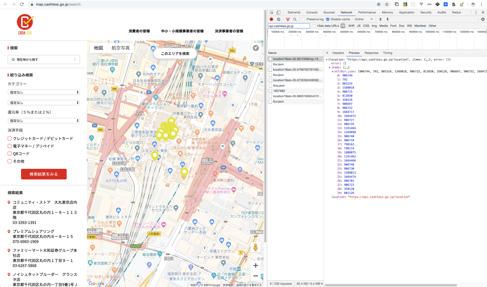
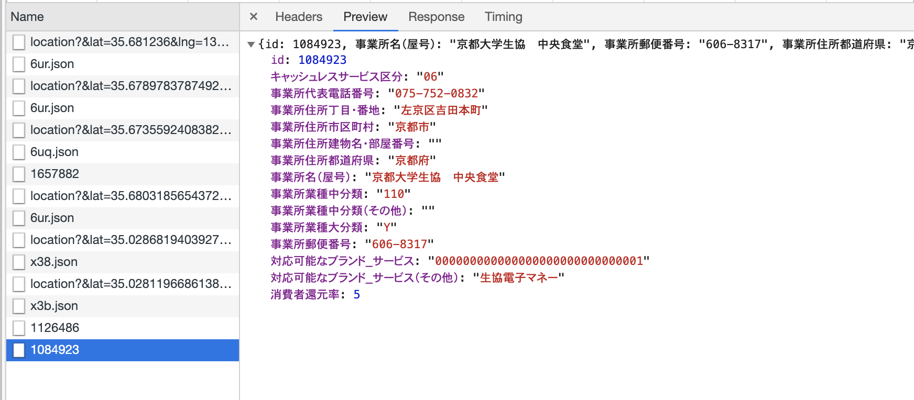
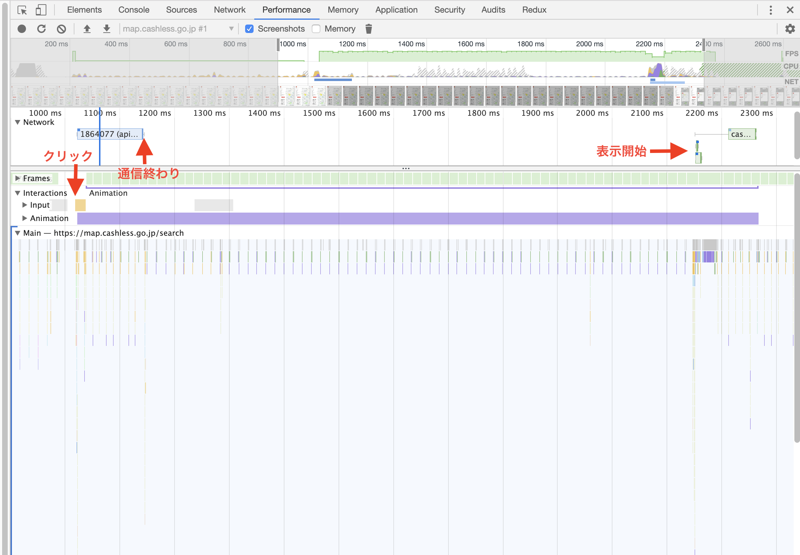
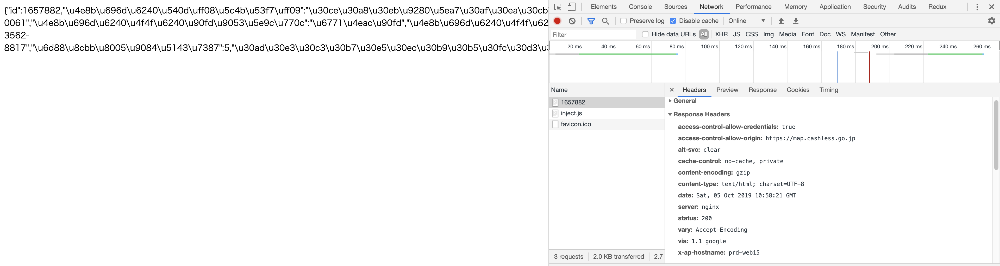

皆さん、キャッシュレス決済してますか？  
僕は現金を月 1 万使うかどうかぐらいのキャッシュレス生活を送っています。どら([@d0ra1998](https://twitter.com/d0ra1998/))です。

さて、こちらの[キャッシュレス・消費者還元事業サイト](https://map.cashless.go.jp/search)、ご覧になりましたか？  
アプリも出ていますが、なんか重いんですよね。

アプリの方は面倒な気がして、Web 版の通信を眺めていたらなかなかすごい実装が見えてきたので、まとめてみました。

## おことわり

本記事に掲載の情報などは、「検索画面」（キャッシュレス・消費者還元事業）( https://map.cashless.go.jp/search )より得られるデータを加工して作成しています。

## ヤバポイント ①: 位置検索 API に情報が全く含まれず、デカイ JSON ファイルを別で見に行く



地図上で「このエリアを検索」ボタンを押すと、緯度経度を元に絞り込む API を叩きに行きます。ここまではいいのですが、返ってきた情報に含まれるのは、

- JSON の静的ファイルのパス
- 上記の JSON ごとに分けられた店舗 ID の配列(30 件)

のみ。どうやら、エリアで区切って静的な JSON を用意してるらしく、API の結果を元にプロットするにはさらにそれを取りに行かなければいけないようです。せめて、**緯度経度だけでも含んであげれば、先にプロットはできる**のに…。

さて、その地域ごとの json を開いてみると、なんか量が多い…。サクッと調べてみると、

```
❯ curl https://api.cashless.go.jp/location/xn7/6uq.json | jq '.[].name' | wc -l
    1653
```

**1600 件以上の店舗データを 30 件プロットするために DL**してるの！？そりゃ重いわけですわ…。

もちろん、これは地域ごとに分けており、デフォルトの東京駅周辺はこうですが、京大周辺でみると 200 件程度でしたし、なんなら 3 件の地域もありました。都会の検索が地獄という感じですね。  
あと、なぜか**大量に重複店舗**が含まれています。店舗名で雑に重複を排除したところ、500 件近くまで減りました。これは登録ミスっぽくて、[修正頑張るみたい](https://cashless.go.jp/assets/doc/%E3%82%AD%E3%83%A3%E3%83%83%E3%82%B7%E3%83%A5%E3%83%AC%E3%82%B9%E3%83%BB%E3%83%9D%E3%82%A4%E3%83%B3%E3%83%88%E9%82%84%E5%85%83%E4%BA%8B%E6%A5%AD%E3%81%AB%E9%96%A2%E3%81%99%E3%82%8B%E4%BB%8A%E5%BE%8C%E3%81%AE%E5%AF%BE%E5%BF%9C%E3%81%AB%E3%81%A4%E3%81%84%E3%81%A6.pdf)ですね。

軽く調べたニワカなので詳しい言及は避けますが、この JSON の方に`Cache-Control`ヘッダが一切設定されていないのもいかがなものでしょう…？  
また、この静的 JSON ファイル、アプリでキャッシュはある程度行なっているのかも気になるところです。

## ヤバポイント ②: JSON のフィールド名が日本語



詳細情報を返す API、なんとフィールド名が日本語でした…。初めてみた…。

## ヤバポイント ③: 謎の setTimeout

API に問題がありつつも、やはり詳細情報のローディングも遅い。  
パフォーマンス計測をしてみると、やけにレスポンスから表示に間が空いている。



調べてみると、データ取得後にローディング表示解除をするコードが `setTimeout` で 1 秒後に設定されている…？もしかしたら意味があるのかもしれませんが、これがあるために通信状態に関わらず、表示が遅いのかなという感じがします。

## ヤバポイント ④: Content-Type が未設定

API レスポンスを見ようと URL を直打ちした僕。**「あれ？Chrome 拡張入れてるのに、整形表示されない？」**



```
content-type: text/html; charset=UTF-8
```

ンンンンンンンンッ！？！？お前、実は JSON じゃないのか…？

### 個人的ツボ: 対応可能なブランド・サービスの返しかたがすごい

```
対応可能なブランド_サービス: "000000000010000000000000000000"
```

これ、通信量としては減るかもしれないけど、ブランドやサービスが増えた時に整合性取るのめんどくさそう…。職業エンジニアの方に聞きたいんですが、こういう実装って割とあるもんなんですか？

## まとめ

アプリ重くね？という軽い気持ちで始めた調査で、まさかこんな実装が見えてくるとはという感じでした。他にも JS ソースを見たらもっと色々あったんですが、そろそろやめておきます。

出典を記載すればデータ利用は自由（[利用規約](https://cashless.go.jp/terms_of_use.html)）っぽいので、我こそはというエンジニアの方々はぜひ力を貸してあげるといいかもですね…（）  
これ**もはやハッカソンとかを政府がやればいいのでは？？？**

なお、この政策自体はツッコミどころは多いものの、僕はある程度喜んでいることも付け加えておきます。


