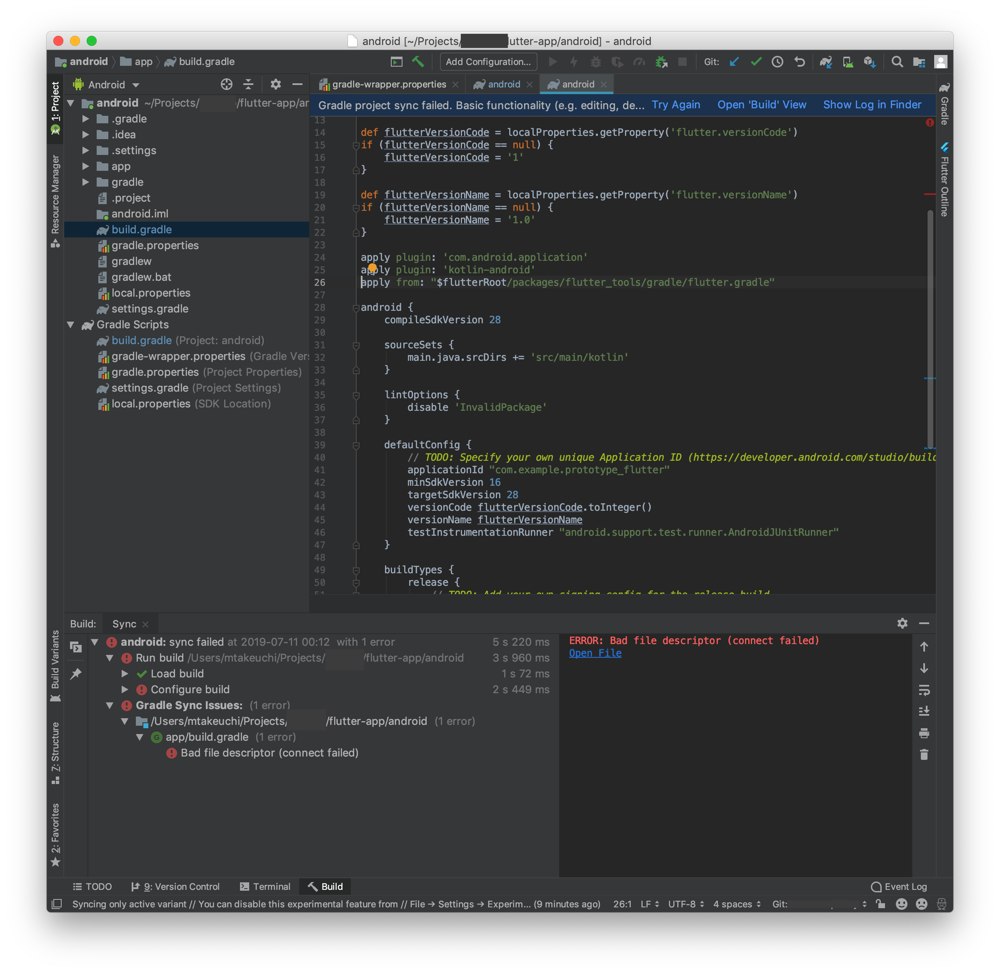

最近、また少しネイティブアプリへの興味が出てきています。そんな中、Flutter を触っていたのですが、新しい MBP にセットアップしていたところ、なぜかビルドが通らない！

## 発生したエラー

Android 向けにアプリをデバッグビルドした際、`Resolving dependencies...`の後に以下のエラーが出て停止してしまいました。

```
* Error running Gradle:
ProcessException: Process "/Users/mtakeuchi/Projects/xxxxxx/flutter-app/android/gradlew" exited abnormally:

> Configure project :app

Project evaluation failed including an error in afterEvaluate {}. Run with --stacktrace for details of the afterEvaluate {} error.

FAILURE: Build failed with an exception.

* Where:
Build file '/Users/mtakeuchi/Projects/xxxxxx/flutter-app/android/app/build.gradle' line: 26

* What went wrong:
A problem occurred evaluating project ':app'.
> Could not resolve all artifacts for configuration 'classpath'.
   > Could not download javawriter.jar (com.squareup:javawriter:2.5.0)
      > Could not get resource 'https://jcenter.bintray.com/com/squareup/javawriter/2.5.0/javawriter-2.5.0.jar'.
         > Could not HEAD 'https://jcenter.bintray.com/com/squareup/javawriter/2.5.0/javawriter-2.5.0.jar'.
            > Connect to jcenter.bintray.com:443 [jcenter.bintray.com/52.42.33.115, jcenter.bintray.com/34.211.6.217] failed: Bad file descriptor (connect failed)
   ...(中略)

* Try:
Run with --stacktrace option to get the stack trace. Run with --info or --debug option to get more log output. Run with --scan to get full insights.

* Get more help at https://help.gradle.org

BUILD FAILED in 3s
  Command: /Users/mtakeuchi/Projects/xxxxxx/flutter-app/android/gradlew app:properties

Finished with error: Please review your Gradle project setup in the android/ folder.
```

最初ネットワークエラーを疑いましたが、エラー中のリンクをブラウザで開くと普通に DL できましたし、ファイアーウォールを切ったりしても効果はなし。

次に、`android`フォルダ内のみを開き、Gradle の Sync を行うと、下図のように`flutter.gradle`を SDK から読み込む段階でエラーが発生している様子が窺えます。



## 開発環境

この時の手元の環境を確認すると以下のようになっていました。

```
❯ flutter doctor -v
[✓] Flutter (Channel stable, v1.7.8+hotfix.3, on Mac OS X 10.14.5 18F203, locale ja-JP)
    • Flutter version 1.7.8+hotfix.3 at /Users/mtakeuchi/flutter
    • Framework revision b712a172f9 (19 hours ago), 2019-07-09 13:14:38 -0700
    • Engine revision 54ad777fd2
    • Dart version 2.4.0


[✓] Android toolchain - develop for Android devices (Android SDK version 29.0.0)
    • Android SDK at /Users/mtakeuchi/Library/Android/sdk
    • Android NDK location not configured (optional; useful for native profiling support)
    • Platform android-29, build-tools 29.0.0
    • Java binary at: /Applications/Android Studio.app/Contents/jre/jdk/Contents/Home/bin/java
    • Java version OpenJDK Runtime Environment (build 1.8.0_152-release-1343-b01)
    • All Android licenses accepted.

[✓] Xcode - develop for iOS and macOS (Xcode 10.2.1)
    • Xcode at /Applications/Xcode.app/Contents/Developer
    • Xcode 10.2.1, Build version 10E1001
    • CocoaPods version 1.7.4

[✓] iOS tools - develop for iOS devices
    • ios-deploy 1.9.4

[✓] Android Studio (version 3.4)
    • Android Studio at /Applications/Android Studio.app/Contents
    • Flutter plugin version 37.0.1
    • Dart plugin version 183.6270
    • Java version OpenJDK Runtime Environment (build 1.8.0_152-release-1343-b01)

[✓] VS Code (version 1.36.1)
    • VS Code at /Applications/Visual Studio Code.app/Contents
    • Flutter extension version 3.2.0

[✓] Connected device (1 available)
    • Android SDK built for x86 • emulator-5554 • android-x86 • Android 10 (API 29) (emulator)

• No issues found!
```

## 解決方法

`android`フォルダ内のみを開き、`Gradle Scripts`内にある`gradle-wrapper.properties`に書いてある Gradle のバージョンを上げてあげる(ビルドが通っていた旧 MBP のバージョンと揃える)と解決しました。

```
- distributionUrl=https\://services.gradle.org/distributions/gradle-4.10.2-all.zip
+ distributionUrl=https\://services.gradle.org/distributions/gradle-5.1.1-all.zip
```

## 参考情報

`Could not resolve all artifacts for configuration 'classpath'.`というエラーでビルドができない事例自体は、検索すると比較的よくあるようです。

- [Could not resolve all artifacts for configuration &#39;classpath&#39; · Issue #23553 · flutter/flutter](https://github.com/flutter/flutter/issues/23553)
- [Flutter(v1.5.4)で Gradle のバージョンを 3.4.1 あげると死ぬ - ps aux | grep serinuntius](https://serinuntius.hatenablog.jp/entry/2019/06/22/223001)

ただ、`build.gradle`内の`repositories`や`dependencies`をいじる解決策では解決せず、今回のような方法で解決することができました。
