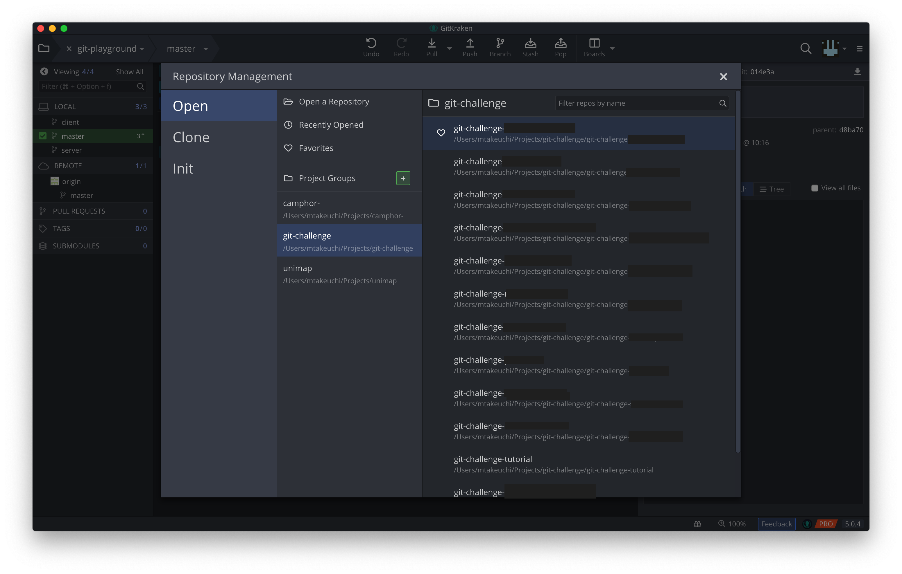

5/19に行われた、株式会社ミクシィ主催の[「git challenge #11」](https://mixi-recruit.snar.jp/jobboard/detail.aspx?id=DxbrxvASR_c)に参加してきました！

## 「git challenge」ってなに？

個人でもチームでも、プロダクト開発には何かと欠かせないgit。  
「git challenge」は、そんなgitを題材にした競技型技術イベントです。#11とある通り、もう11回も開催しているmixiの有名イベントです。

「gitで競技？そんなん何やるん？」というそこのあなた。侮ることなかれ、gitの奥深さを舐めてはいけない…。

## 当日の様子

### 朝: スタバで Git 復習

家族と一緒に家を出た関係で、1時間前に着いたので優雅にスタバに来ました。  
「新作うめー」と思いながら、Git 関連の知識の確認をしていました。まぁ結局そんなにヤマ張れてなかったですが…。

### 午前: 競技説明・LT



午前中は、まず競技説明とgitに関するLTがありました。LTのテーマは、

- Gitで行うドメイン管理

- チュートリアル問題をみんなで解いてみる

の二本立てでした（多分）。

ドメイン管理の方は、モンストでRoute 53の設定をGitで管理してるけど便利でいいよ！みたいな感じの話でした。僕はGoogle Domainsでドメイン持ってるんですが、こちらでもできるならやってみたいなと思いました。方法知ってる方いたら教えてください。

後半はチュートリアル問題を解いてみよう！という内容でしたが、説明早々に抜け駆けしてクリアしたチームが出て面白かったです（他チームが正解するとSlackに通知が来るのでわかる）。

ちなみに、競技で若干Perlが必要な部分があるのですが、説明の時に**「みなさんこれ知ってますかね？"ぱーる"って読むんですけど」**って言い出したの笑いましたｗ

### 豪華なランチ

説明の後は、来たばっかりですが早速ランチです。  
「ロコモーション」という芸能人がケータリングとかで食べたりする(?)お店のお弁当で、ガパオライスやカレーなどがありました。

紐を引くとあったまる弁当で、各机から湯気がもくもく出てて面白かったです(小並感)



### 午後: 競技本番

お腹も一杯になったら、いよいよ競技開始です。ペアの人とも午前中でだいぶ打ち解けられたので、安心して自分の問題に取り組めて良かったです。

問題には難易度に応じて得点が設定されているのですが、各チーム戦略が異なって面白かったです。僕らは順番に簡単な方から解いていきましたが、難問一点狙いに行くチームなど個性が見られました。



途中でワッフルの差し入れがあり、疲れてきた頭に"こうかはばつぐん"でした。

開始が少々早まり、約3時間半の競技時間でしたが、めちゃくちゃ集中してたので一瞬に感じました。終了直後は、あんまり疲れたので無心でぼーっとしてました。

### 夕方: 結果発表

10チームちょっとありましたが、上位であまり差がつかず3チームタイで優勝することができました:tada:



優勝するとメダルやパーカーがもらえたのですが、1セットしか用意がなかったため、解き終わりが遅かったのでもらえませんでした:joy:

### 夜: 懇親会



疲れた頭にはやっぱりぽしゃけ:innocent: 解説を聞きながら飲む酒は最高でしたね(おい

懇親会では、僕は他の人と各社のインターンについて話したりしてましたが、問題をメンターさんと解き直す人もいたりと、各々思い思いに過ごしていました。

## これから参加する人へ

競プロなどと比べると問題のバリエーションが出しづらいこともあり、問題内容については一切書けません:pray:  
ですが、それ以外で「しておくと当日ちょっと楽！」といったことを書いておくので、もし良ければ参考にしてください〜

### git について多少調べておく

内容が事前にわからない以上、悪あがきと言えなくもないですが、使えるかは置いといてある程度どんな機能があるか見ておきましょう。  
問題を見て、どのコマンドを使えばできそうか見当がつくだけでかなり解答が楽になります。

勉強するのには、下の資料がオススメです。「Pro Git」という書籍ですが、有志によって翻訳版が無料で公開されており、基本のきからGitの内部の仕組みまで触れているのでとても良いです。

EPUBやPDFでも配布されているので、git challengeの1週間前くらいからiPadに入れて、向かう新幹線や暇な時などに読んでいました。

[Git - Book](https://git-scm.com/book/ja/v2)

### git の周辺ツールにも慣れておく

本競技では、git のコマンドを叩くことがメインではありますが、周辺ツールに慣れているかどうかも結構解答スピードに関わる要素な気がしています。

例えば、まずrebaseやcommitの際に立ち上がるCLIエディタが挙げられます。僕はこれまで結構これに苦手意識を持っていたんですが、つい最近ConoHaを借りてCLIでいじる場面が増えたので、ある程度スムーズに操作できました。  
コンフリクトの解消もVSCodeなどでいじってもいいですが、やはりvimとか使った方が慣れてたら速いです。

また、CLI中心に操作した方が正確・高速ですが、GUIで見た方が状況がわかりやすい場面もあります。Git を操作できる GUI ソフトウェアとしては、

- GitHub Desktop
- SourceTree
- GitKraken

あたりが有名どころな気がしますが、好きなものを見つけておくと良いでしょう。

僕は GitKraken 派で、特定ディレクトリ以下のサブディレクトリを簡単に切り替えられるプロジェクト機能などがあり好みです。

## まとめ

普段必要な機能以外はなかなか手をつけられない Git ですが、エンジニアを助けてくれる優秀な機能を思ったより遥かにたくさん備えています。  
他のイベントでは見られない面白い、そして為になる体験ができるので、ぜひ気軽に応募してみてください！



あと、複数人で作業してるリポジトリのブランチで**force-push**するのは絶対やめようね！お兄さんとの約束だよ！！
